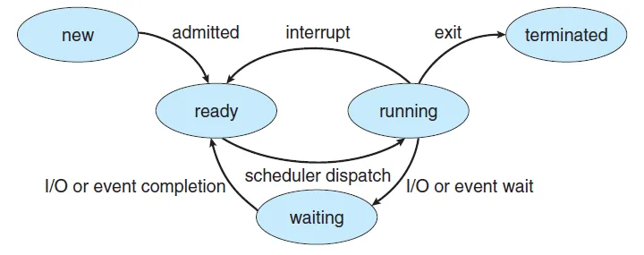
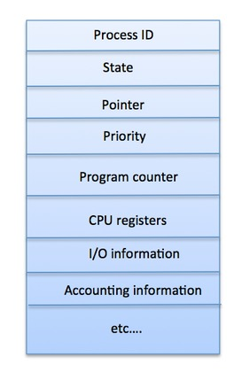
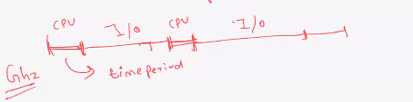
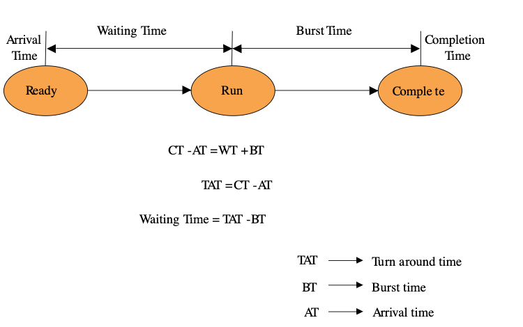
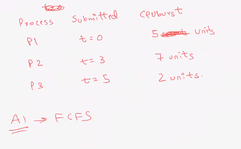
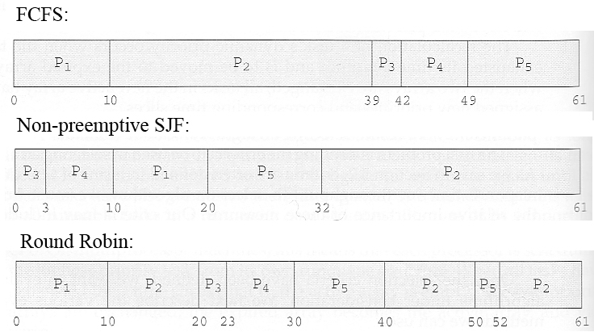

Operating Systems 1
-------------------

Day 1
- basics & terminologies
- Process fundamentals
- Process scheduling

Day 2
- memory management

Day 3
- Inter Process Communication
- Synchronization
- Locks
- Deadlocks
- Reader Writer
- Dining Philosophers
- Producer Consumer
- Case Studies


Mostly theoritical, so stay alert
Keep it interactive

-- --

For a long time, computing was single processor and single threaded.

Programs ran one at a time. Others waited while somone was executing a program


Single Processor Single Process - IO causes CPU to stall. Processes run one at a time.

**MultiProgramming**

Single Processor Multiple Processes - No faster, but better utilization of CPU (or faster resources). Processes can be preempted.
CPU switches task when one task is waiting for I/O

Multiple Processor Multiple Thread - 

-- --


Memory Acess Times
------------------

```
L1 cache reference ........................ 0.5 ns
Branch mispredict ........................... 5 ns
L2 cache reference .......................... 7 ns
Mutex lock/unlock .......................... 25 ns
Main memory reference ..................... 100 ns             
Compress 1K bytes with Zippy ............ 3,000 ns  =   3 µs
Send 2K bytes over 1 Gbps network ...... 20,000 ns  =  20 µs
SSD random read ....................... 150,000 ns  = 150 µs
Read 1 MB sequentially from memory .... 250,000 ns  = 250 µs
Round trip within same datacenter ..... 500,000 ns  = 0.5 ms
Read 1 MB sequentially from SSD* .... 1,000,000 ns  =   1 ms
Disk seek .......................... 10,000,000 ns  =  10 ms
Read 1 MB sequentially from disk ... 20,000,000 ns  =  20 ms
Send packet CA->Netherlands->CA ... 150,000,000 ns  = 150 ms
```

https://gist.github.com/hellerbarde/2843375

-- --

System Boot
-----------

https://www.cs.rutgers.edu/~pxk/416/notes/02-boot.html
http://www.c-jump.com/CIS24/Slides/Booting/Booting.html


1. Power Button
1. BIOS - cip in motherboard (basic i/o system)
    - POST
    - CPU
    - RAM
    - Keyboard, Mouse
    - Video Card
3. Boot Loader
    - Master Boot Record at Cylinder 0, Head 0, Sector 1 (0,0,1)
    - MBR / Grub knows where the kernel is in the Disk
5. Kernel
6. Init (User Space Configuration)
7. Login Prompt

-- --

Boot Logs
---------

```bash
cd /var/log/
sudo dmesg
```

**extra**

- Runlevels in Unix
    1. Single User
    2. Reserved (mostly) (full multi with GUI on debian)
    3. Full multi user without GUI
    4. undefined
    5. Full multi user with GUI
    6. Reboot
- Switch runlevels - `init 3` or `telinit 3`.

-- --

What does OS do?
----------------

Consider two programs. Merge Sort, Download file, ..

They will have the following in common

- Input - Keyboard, Network, HDD
- RAM storage - allocating and deallocating memory
- CPU
    - computations
    - interpretting instructions
- GPU
- Output - Screen, Network, Audio

OS provides these things. So OS is basically a system that provides programs and libraries for these.

It is an interface b/w user and hardware

user - OS - hardware (cpu, memory, i/o)

Two most important functionalities provided by OS
- Process Management
- Memory Management
- other: Resource Management /Disk/File/IO/Security/Integrity/Customization/...

-- --

Process Life Cycle
------------------



- New: The process which is being created (long term scheduler)
- Running: Instructions being executed
- Waiting: The process is waiting for an event to get occur
- Ready: The process is waiting to be assigned to a processor
- Terminated: The process completed its execution

These names of the states are uninformed and they vary across operating system. These stats are mostly found on all systems but some operating systems also more finely define process states. Processer can hold only one process at a time simply it can be running one process at a time. However, many processes may be ready or waiting.
-- --

**Processes waiting in Job Pool**

**Long Term Scheduler**
- selects the process that are to be placed in ready queue.
- decides the priority in which processes must be placed in main memory

**Medium-Term Scheduler**
- places the blocked and suspended processes in the secondary memory (swapping out)
- moving back a swapped out process from secondary memory to main memory is known as swapping in

**Short-Term Scheduler**
- decides the priority in which processes is in the ready queue are allocated CPU time for execution.

-- --

Context Switching
-----------------
**Triggers:**
- Multitasking
- Interrupt Handling
- User and Kernel mode Switch 

Hardware Bit - Mode controls what mode we're in. User mode or Kernel Mode. Use sys calls to access Kernel Mode.


-- --

Process Control Block
---------------------



-- --

Burst, Turn Around, Total times, Response Time
----------------------------------------------

CPU burst, IO burst
Process has mixed CPU and IO bursts


CPU metrics
-----------

CPU utilization - avg CPU activity

Throuput - processes per unit time

User Metrics



1. Arrival Time: The time at which the process enters into the ready queue is called the arrival time.
2. Burst Time: The total amount of time required by the CPU to execute the whole process is called the Burst Time. This does not include the waiting time. It is confusing to calculate the execution time for a process even before executing it hence the scheduling problems based on the burst time cannot be implemented in reality.
3. Completion Time: time at which the process enters into the completion state or the time at which the process completes its execution, is called completion time.
4. Turnaround time: The total amount of time spent by the process from its arrival to its completion, is called Turnaround time.
5. Waiting Time: The Total amount of time for which the process waits for the CPU to be assigned is called waiting time.
6. Response Time: The difference between the arrival time and the time at which the process first gets the CPU is called Response Time.


-- --

Gantt Chart
-----------



-- --

Scheduling Algos
----------------

FCFS - non preemptive
- convoy effect: long processes cause short ones to starve
SJF - non preemptive
SRTF - preemptive

-- --

How does the OS determine the Burst Time?
-----------------------------------------

- needed for SJF and SRTF
- estimate based on an initial starting default burst value and actual historical run values.
- assigned a default estimated value for its first burst
- last estimated burst and the last actual burst are averaged to provide the process's next estimated burst.
- ensures getting close to the median value

- wouldn't choose this method for scheduling a general purpose system
- prefer a combined priority/quantum scheduling arrangement
- With SJF, a busy system with many short burst jobs could starve the longer burst CPU intensive jobs. And if a job had short previous run times then got into a compute intensive loop, even other "short" jobs could wait excessive times before getting CPU time. It can work well for systems that aren't excessively CPU bound and for systems where the process run times are reasonably consistent.

- In a priority/quantum round robin based systems, jobs with the same priority are given at lease some CPU time, but will relinquish the CPU to other equal priority processes when it's quantum ends and will wait for its turn to come around again. If a higher priority process needs CPU time, it can preempt lower priority processes. Various priority boosting methods can prevent complete starvation of low priority jobs on busy systems.

-- --

Round Robin
-----------

preemptive

https://codepen.io/faso/pen/zqWGQW

-- --

Starvation, Priority
--------------------

-- --

Completely Fair Scheduler
-------------------------

https://en.wikipedia.org/wiki/Completely_Fair_Scheduler
https://www.linuxjournal.com/node/10267

-- --

Books - Galvin
--------------
