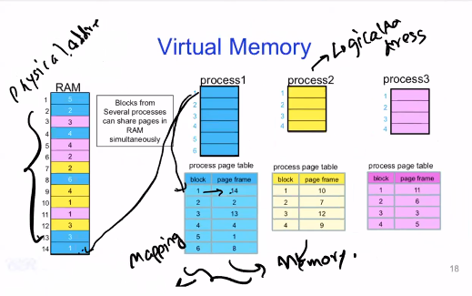
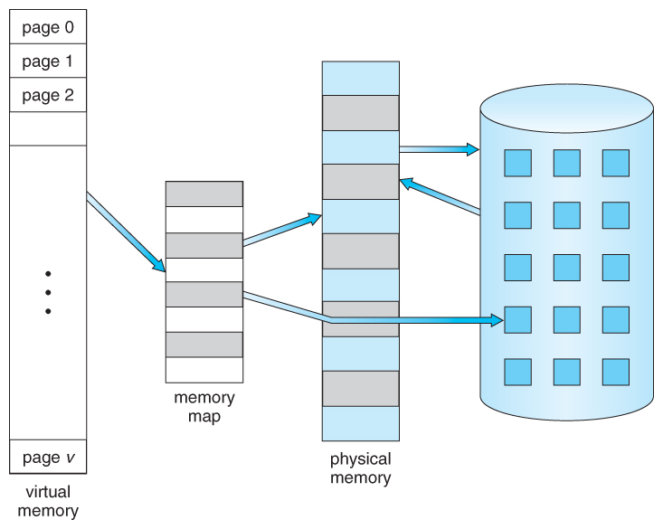
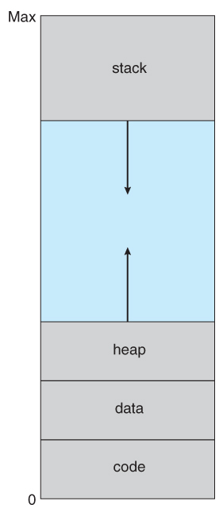
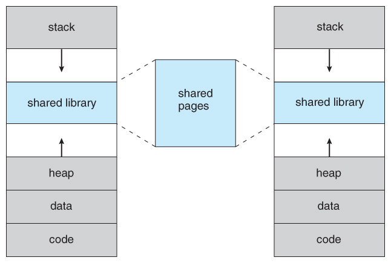
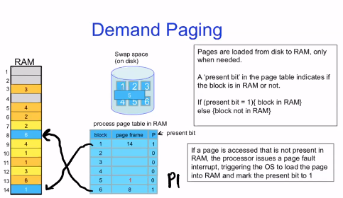
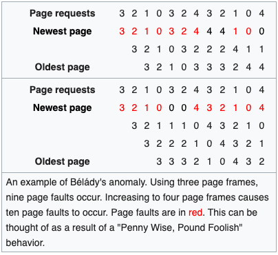
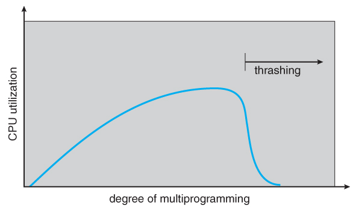

Operating Systems 2
-------------------

1. Don't worry too much
2. Can't cover 4 years worth of theory in 6 months
3. From an interview point of view, we will cover whatever can be expected in interviews and some other theory
4. If from a different background, either read on your own
    - Galvin
    - online courses
    - https://www.cs.uic.edu/~jbell/CourseNotes/OperatingSystems/
5. Of just ignore it

-- --

Memory Allocation, Protection and Management
--------------------------------------------

1. Multiple processes doing things.
2. Each has its own instructions and data, which need to be present in the RAM
3. Each process must have its personal memory
4. Someone needs to allocate, manage and protect memory
    - Who is assigned what memory, and what memory is free
    - If a process accesses data, we need to make sure that illegal access do not happen
    - Since OS does process management, OS must also do memory mangement

-- --

Virtual Memory
--------------

**Physical Memory:** RAM
**Logical Memory:** Logical Address Space - Each process is seeing only itself in the memory and noone else (unless specified). The addresses start from 0 for ease of programming and compiling.

Both P1 and P2 are accessing the same addresses in their logical space

Mapping from Logical to Physical address is stored in the processs' memory table. Memory table is stored in the MMU (Memory Management Unit) - actual hardware chip

-- --

Contiguous Memory Allocation
----------------------------

1. Simplest way: allocate memory in a **contiguous** manner
2. process tells you how much memory it needs, you give it a contiguous chunk of that size
3. Issues
    1. **Fragmentation:** Processes start and end, so random chunks of random sized memory gets free and reserved. Causes a lot of holes to appear
    2. Difficult to find a contiguous chunk that is of sufficient size. Can't allocate memory, even though we have some available
        - move memory of some other process - defrag
        - assign non-contiguous chunks of memory
    3. Difficult to know beforehand what the exact memory requirements are

**Algorithms**

First Fit - return the first one
Last Fit - return the last one - switch around
Best Fit - return the one with the closest size (can use BBST?)
Worst Fit - so that the program can expand if needed

-- --

Paging
------

- Divide memory into equal sized frames and pages
- Chunk of main memory = frame
- Chunk of virtual memory = page
- Allocate some pages to a process
- maintain the mapping

Frame Size = Page size

**Issues**
- entire process still had to be stored in memory somewhere.
- most real processes do not need all their pages, or at least not all at once
    - Error handling code is not needed unless that specific error occurs
    - Arrays are often over-sized for worst-case scenarios
    - Certain features of certain programs are rarely used

**Approach**
The ability to load only the portions of processes that were actually needed

**Benefits**
- Programs could be written for a much larger address space ( virtual memory space ) than physically exists
- each process is only using a fraction of their total address space, there is more memory left for other programs, improving CPU utilization and system throughput.
- less I/O is needed for swapping processes in and out of RAM, speeding things up.

- Note that the address space shown in Figure 9.2 is sparse - A great hole in the middle of the address space is never used, unless the stack and/or the heap grow to fill the hole.

- Virtual memory also allows the sharing of files and memory by multiple processes, with several benefits:
System libraries can be shared by mapping them into the virtual address space of more than one process.
Processes can also share virtual memory by mapping the same block of memory to more than one process.
Process pages can be shared during a fork( ) system call, eliminating the need to copy all of the pages of the original ( parent ) process.

Demand Paging
-------------

The basic idea behind demand paging is that when a process is swapped in, its pages are not swapped in all at once. Rather they are swapped in only when the process needs them. ( on demand. ) This is termed a lazy swapper, although a pager is a more accurate term.

-- --

Page Replacement Algorithms
---------------------------
- If OS uses paging for VM
- page replacement algorithms decide which memory pages to
    - page out/swap out
    - or write to disk
- when a page of memory needs to be allocated.

- Page replacement happens when
    - a requested page is not in memory (page fault)
    - and a free page cannot be used to satisfy the allocation because
        - there are none,
        - the number of free pages is lower than some threshold

-- --

Online Algorithms
-----------------
- First in First Out
- Last in First Out - stupid
- Least Recently Used
- Least Frequently Used

-- --

Optimal Deterministic Algorithm
-------------------------------

Optimal - looks into the future

-- --

Bélády's anomaly
----------------

First noticed in FIFO.
Doesn't happen in LRU and some stack based algos

1969 - 2 as an approx upper limit
Number of page faults in larger memory vs number of page faults in smaller memory

2010 - unbounded

Example:

-- --

Thrashing
---------

- If a process cannot maintain its minimum required number of frames, then it must be swapped out, freeing up frames for other processes. This is an intermediate level of CPU scheduling.
- But what about a process that can keep its minimum, but cannot keep all of the frames that it is currently using on a regular basis? In this case it is forced to page out pages that it will need again in the very near future, leading to large numbers of page faults.
- A process that is spending more time paging than executing is said to be thrashing.

Cause of Thrashing
------------------

- Early process scheduling schemes would control the level of multiprogramming allowed based on CPU utilization, adding in more processes when CPU utilization was low.
- The problem is that when memory filled up and processes started spending lots of time waiting for their pages to page in, then CPU utilization would lower, causing the schedule to add in even more processes and exacerbating the problem! Eventually the system would essentially grind to a halt.
- Local page replacement policies can prevent one thrashing process from taking pages away from other processes, but it still tends to clog up the I/O queue, thereby slowing down any other process that needs to do even a little bit of paging ( or any other I/O for that matter. )

- To prevent thrashing we must provide processes with as many frames as they really need "right now", but how do we know what that is?
- The locality model notes that processes typically access memory references in a given locality, making lots of references to the same general area of memory before moving periodically to a new locality, as shown in Figure 9.19 below. If we could just keep as many frames as are involved in the current locality, then page faulting would occur primarily on switches from one locality to another. ( E.g. when one function exits and another is called. )
- The working set model is based on the concept of locality, and defines a working set window, of length delta. Whatever pages are included in the most recent delta page references are said to be in the processes working set window, and comprise its current working set, as illustrated in Figure 9.20:
