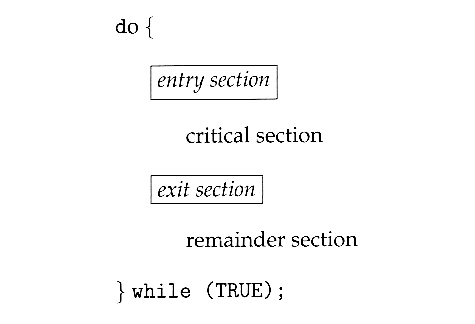
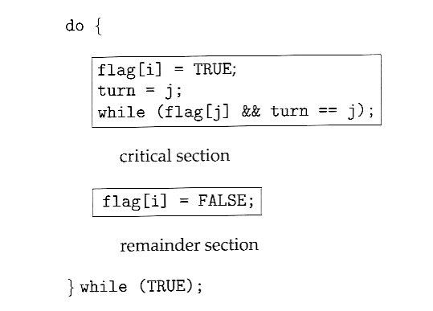
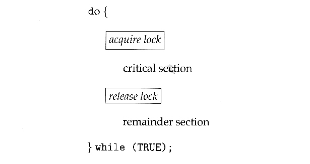
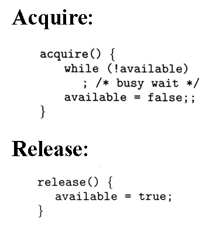
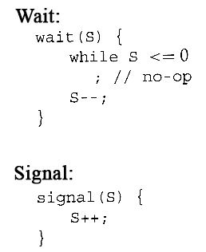
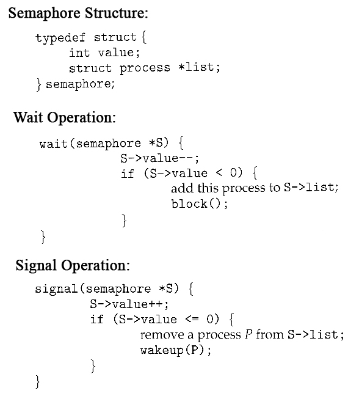
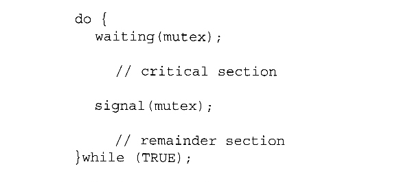
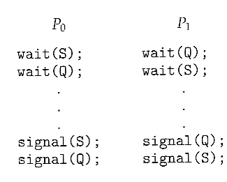
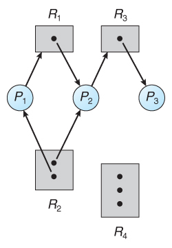

Operating Systems 3
-------------------


Inter Process Communication
---------------------------

- Common data shared
- share results of computation
- or synchronize the programs

-- --

Producer Consumer Problem
-------------------------

- Producer: Produces data
- Consumer: Consumed data
- Shared data buffer

**Constraints**
1. Producer should not produce when buffer is full
2. Consumer should not consume when buffer is empty
3. Every item must be consumed by the consumer exactly once

Code

```python
buffer = [None] * N

def producer():
    while True:
        while count == N:
            pass
        buffer[front] = produce_item()
        front = (front + 1) % N
        count += 1
    
def consumer():
    while True:
        while count == 0:
            pass
        item = buffer[rear]
        rear = (rear + 1) % N
        count -= 1
```

- does this code work (ignoring the concurrency issues)?
Yes.

-- --

Race Condition
--------------

- counter an become inconsistent
    ```python
    # to do counter += 1, we basically do
    LOAD counter register_1
    INC  register_1
    SAVE register_1 counter
    ```
- context switches in b/w can lead to inconsistency
- occurs rarely and extremely hard to debug

-- --

Critical Section
----------------

Use smaller atomic operation to create large, custom atomic operation



-- --


Mutual Exclusion
----------------

Only one process in CS at a time. Otherwise, we get race condition

-- --

Progress
--------

If no process is currently executing in their critical section, and one or more processes want to execute their critical section, then only the processes not in their remainder sections can participate in the decision, and the decision cannot be postponed indefinitely. I.e. processes cannot be blocked forever waiting to get into their critical sections.

-- --

Bounded Waiting
---------------

There exists a limit as to how many other processes can get into their critical sections after a process requests entry into their critical section and before that request is granted. ( I.e. a process requesting entry into their critical section will get a turn eventually, and there is a limit as to how many other processes get to go first. )

Opposite - starvation
-- --

Peterson's Solution
-------------------



- flag: tells the other guy to wait
- turn: to prevent a deadlock where everyone is waiting. Ensures that atleast 1 is running CS.

-- --

MuteX
-----



Note: aquiring and releasing locks is atomic



cons: busy wait - splinlocks
pros: no context switch

Semaphores
----------

- integer variables
- wait and signal, both atomic, only 2 operations defined





Note that S++, S-- is atomic here
On single processors this can be implemented by disabling interrupts during the execution of wait and signal; Multiprocessor systems have to use more complex methods, including the use of spinlocking.

Binary Semaphore -> Mutex
-------------------------



Counting Semaphore
------------------

Integer values


-- --

Resource Allocation graph & Deadlocks revisited
-----------------------------------------------



Conditions
1. Mutual Exclusion
2. Hold and Wait
3. No preemption
4. Circular Wait




no cycle = no deadlock
cycle and only one of each resource = deadlock

-- --

Handling Deadlocks
------------------

1. Prevention: Deadlocks can be prevented by preventing at least one of the four required conditions:
    - Mutual Exclusion
        - Shared resources such as read-only files do not lead to deadlocks.
        - Unfortunately some resources, such as printers and tape drives, require exclusive access by a single process.
    - Hold and Wait
        - Require that all processes request all resources at one time. This can be wasteful of system resources
        - Require that processes holding resources must release them before requesting new resources, and then re-acquire the released resources along with the new ones in a single new request.
        - above can lead to starvation if a process requires one or more popular resources.
    - No preemption
        - difficult to save resource state
    - Circular Wait
        - One way to avoid circular wait is to number all resources, and to require that processes request resources only in strictly increasing ( or decreasing ) order.
        - In other words, in order to request resource Rj, a process must first release all Ri such that i >= j.
        - One big challenge in this scheme is determining the relative ordering of the different resources
2. Avoidance - Banker's algorithm
3. Detection
4. Recovery
    - terminate
    - preempt

Unix, Windows simply ignores!


-- --

Bounded Buffer Problem
----------------------

-- --

Dining Philosophers Problem
---------------------------

-- --

Reader Writer Problem
---------------------

-- --

Implementing Locks in Code
--------------------------

Java

import java.util.concurrent.*; 

Semaphore(int num)
Semaphore(int num, boolean inorder)

sem.acquire()
sem.release()

[Semaphore (Java Platform SE 7 )](https://docs.oracle.com/javase/7/docs/api/java/util/concurrent/Semaphore.html)

[Semaphores](http://tutorials.jenkov.com/java-concurrency/semaphores.html)
