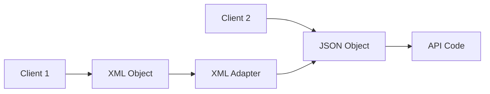

# Abstract Factory and adapter design patterns

- [Abstract Factory and adapter design patterns](#abstract-factory-and-adapter-design-patterns)
  - [Abstract Factory](#abstract-factory)
    - [Advantages of Abstract Factory](#advantages-of-abstract-factory)
    - [Implementation](#implementation)
  - [Recap](#recap)
  - [Structural Patterns](#structural-patterns)
    - [Adapter](#adapter)
    - [Problem](#problem)
    - [Implementation](#implementation-1)
    - [Advantages](#advantages)
  - [Design patterns in different languages](#design-patterns-in-different-languages)
    - [Abstract Factory](#abstract-factory-1)
      - [Python](#python)
      - [JavaScript](#javascript)
    - [Adapter](#adapter-1)
      - [Python](#python-1)
      - [JavaScript](#javascript-1)

## Abstract Factory

> The abstract factory pattern is a creational pattern that provides an interface for creating families of related or dependent objects without specifying their concrete classes.

Let us take the example of a classroom. We have already created a `User` abstract class. Now we will create the concrete classes `Student` and `Teacher`. To restrict the usage of subclasses, we can create factories for each of the concrete classes. The `StudentFactory` will be used to create `Student` objects and the `TeacherFactory` will be used to create `Teacher` objects.
 

```java
class StudentFactory {
    public User createStudent(String firstName, String lastName) {
        return new Student(firstName, lastName);
    }
}

class TeacherFactory {
    public User createTeacher(String firstName, String lastName) {
        return new Teacher(firstName, lastName);
    }
}
```

So now in order to create a classroom, we can use the respective factories to create the objects.

```java
StudentFactory studentFactory = new StudentFactory();
Student student = studentFactory.createStudent("John", "Doe");

TeacherFactory teacherFactory = new TeacherFactory();
Teacher teacher = teacherFactory.createTeacher("John", "Doe");
```

But now we have a problem, we can use the factories to create any type of student and teacher. Should a teacher teaching Physics be able to teach a student of Biology class? This is where the concept of related or a family of objects comes into play. The `Student` and `Teacher` objects are related to each other. A teacher should only be able to teach a student of the same class. So we can create a factory that can create a family of related objects. The `ClassroomFactory` will be used to create `Student` and `Teacher` objects of the same class.

```java
abstract class ClassroomFactory {
    public abstract Student createStudent(String firstName, String lastName);
    public abstract Teacher createTeacher(String firstName, String lastName);
}
```

Now we can create concrete factories for each family of related objects that we want to create.

```java
class BiologyClassroomFactory extends ClassroomFactory {
    @Override
    public Student createStudent(String firstName, String lastName) {
        return new BiologyStudent(firstName, lastName);
    }

    @Override
    public Teacher createTeacher(String firstName, String lastName) {
        return new BiologyTeacher(firstName, lastName);
    }
}
```
The class `ClassroomFactory` is an abstract class that contains the factory methods for creating the objects. The child classes can override the factory methods to create objects of their own type. The client code can request an object from the factory class without having to know the class of the object that will be returned.

```java
ClassroomFactory factory = new BiologyClassroomFactory();
Student student = factory.createStudent("John", "Doe");
Teacher teacher = factory.createTeacher("John", "Doe");
```

The class `ClassroomFactory` becomes our abstract factory that essentially is a factory of factories.

### Advantages of Abstract Factory
* `Isolate concrete classes` - The client code is not coupled to the concrete classes of the objects that it creates.
* `Easy to exchange product families` - The client code can request an object from the factory class without having to know the class of the object that will be returned. This makes it easy to exchange product families.
* `Promotes consistency among products` - The client code can request an object from the factory class without having to know the class of the object that will be returned. This makes it easy to maintain consistency among products.

### Implementation
1. `Abstract product interface` - Create an interface for the products that will be created by the factory.
```java
interface Button {
    void render();
    void onClick();
}
```
2. `Concrete products` - Create concrete classes that implement the product interface.
```java
class RoundedButton implements Button {
    @Override
    public void render() {
        System.out.println("Rendered rounded button");
    }

    @Override
    public void onClick() {
        System.out.println("Clicked rounded button");
    }
}
```

3. `Abstract factory interface` - Create an interface for the abstract factory that will be used to create the products.
```java
interface FormFactory {
    Button createButton();
}
```

4. `Concrete factories` - Create concrete classes that implement the abstract factory interface.
```java
class RoundedFormFactory implements FormFactory {
    @Override
    public Button createButton() {
        return new RoundedButton();
    }
}
```
5. `Client code` - Request an object from the factory class without having to know the class of the object that will be returned.
```java
FormFactory factory = new RoundedFormFactory();
Button button = factory.createButton();
```

## Recap
* The factory pattern is a creational design pattern that can be used to create objects without having to specify the exact class of the object that will be created.
* It reduces the coupling between the client code and the class of the object that it is creating.
* Simple factory - The factory class contains a static method for creating objects. This technique is easy to implement, but it is not extensible and reusable. It violates the open-closed principle and the single responsibility principle.
* Factory method - The responsibility of creating the object is shifted to the child classes. The factory method is implemented in the base class and the child classes can override the factory method to create objects of their own type. This technique is extensible and reusable. It follows the open-closed principle and the single responsibility principle.

## Structural Patterns
> Structural patterns are design patterns that ease the design by identifying a simple way to realize relationships between entities.

> Structural patterns are concerned with how classes and objects are composed to form larger structures.

### Adapter

> The adapter pattern is a structural pattern that allows objects with incompatible interfaces to collaborate.

We come across adapters in our day to day life. For example, we have a 3 pin plug and we want to use it in a 2 pin socket. We can use an adapter to convert the 3 pin plug to a 2 pin plug. 

So, we use an adapter to allow two incompatible interfaces to work together.
Similarly, in software development, we have two incompatible interfaces and we want to use them together. We can use an adapter to convert one interface to another. For instance, we have an API that returns a list of users. Now the request to this API requires a JSON object. Some clients instead of sending a JSON object, want to send an XML object. 

Should we change the API to accept an XML object? Should we create a new API that accepts an XML object? No, that would be redundant. This is where the adapter pattern comes into play. We can create an adapter that converts the XML object to a JSON object and then use the existing API.



You can create an adapter. This is a special object that converts the interface of one object so that another object can understand it.

An adapter wraps one of the objects to hide the complexity of conversion happening behind the scenes. The wrapped object isn’t even aware of the adapter. For example, you can wrap an object that operates in meters and kilometers with an adapter that converts all of the data to imperial units such as feet and miles.

Adapters can not only convert data into various formats but can also help objects with different interfaces collaborate. Here’s how it works:

* The adapter gets an interface, compatible with one of the existing objects.
* Using this interface, the existing object can safely call the adapter’s methods.
* Upon receiving a call, the adapter passes the request to the second object, but in a format and order that the second object expects.

### Problem

Let us take the example of payment processing.
As a part of our application we want to integrate with different payment gateways.
We first use the Stripe payment gateway. The stripe team provides us with a library that we can use to integrate with their payment gateway.

```java
public class StripeApi {
    public void createPayment() {
        // Create payment
    }

    public PaymentStatus checkStatus(String paymentId) {
        // Check payment status
    }
}
```

We use the Stripe API to create a payment and check the status of the payment.

```java
public void processPayment() {
    StripeApi stripeApi = new StripeApi();
    Payment object = stripeApi.createPayment();
    PaymentStatus status = stripeApi.checkStatus(object.getId());
}
```

Now we want to integrate with another payment gateway. We use the PayPal payment gateway. The PayPal team provides us with a library that we can use to integrate with their payment gateway.

```java
public class PayPalApi {
    public void makePayment() {
        // Create payment
    }

    public PaymentStatus getStatus(String paymentId) {
        // Check payment status
    }
}
```

As you can see, the Stripe API and the PayPal API have different method names. The Stripe API uses `createPayment` and `checkStatus` while the PayPal API uses `makePayment` and `getStatus`.
Should we change where we use the Stripe API to use the PayPal API? No, that would be redundant. That would require us to change the code in multiple places. Apart from the additional work, it would also increase the chances of introducing bugs. Also, when we want to switch back to the Stripe API, we would have to change the code again. Hence, our code is also violating SRP and OCP. We are also using concrete classes instead of interfaces. This makes our code tightly coupled.

### Implementation

1. `Incompatible classes` - You should have two classes that have incompatible interfaces. For example, the Stripe API and the PayPal API.
```java
public class StripeApi {
    public void createPayment() {
        // Create payment
    }

    public PaymentStatus checkStatus(String paymentId) {
        // Check payment status
    }
}

public class PayPalApi {
    public void makePayment() {
        // Create payment
    }

    public PaymentStatus getStatus(String paymentId) {
        // Check payment status
    }
}
```

2. `Adapter interface` - Create an interface for the adapter that will be used to convert the incompatible interfaces.
```java
public interface PaymentProvider {
    void makePayment();
    PaymentStatus getStatus(String paymentId);
}
```

3. `Concrete adapter classes` - Create a class that implements the target interface. This is the class that the client code expects to work with. The adapter will convert the interface of the existing class to this interface.
```java
public class StripeAdapter implements PaymentProvider {

    @Override
    public void makePayment() {
        ...
    }

    @Override
    public PaymentStatus getStatus(String paymentId) {
        ... 
    }
}

public class PayPalAdapter implements PaymentProvider {

    @Override
    public void makePayment() {
        ...
    }

    @Override
    public PaymentStatus getStatus(String paymentId) {
        ... 
    }
}
```

4. `Transform request and delegate to original class` - In the adapter class, transform the request to the format that the original class expects. Then, call the original class to perform the operation.
```java
public class StripePaymentProvider implements PaymentProvider {

    private StripeApi stripeApi = new StripeApi();

    @Override
    public void makePayment() {
        stripeApi.createPayment();
    }

    @Override
    public PaymentStatus getStatus(String paymentId) {
        StripeStatus status =  stripeApi.checkStatus(paymentId);
        return convertStatus(status);
    }
}
```

5. `Client code` - The client code expects to work with the target interface. The client code doesn’t know that the adapter is converting the interface of the original class.
```java
public class PaymentProcessor {
    private PaymentProvider paymentProvider;

    public PaymentProcessor(PaymentProvider paymentProvider) {
        this.paymentProvider = paymentProvider;
    }

    public void processPayment() {
        paymentProvider.makePayment();
        PaymentStatus status = paymentProvider.getStatus("paymentId");
    }
}
```

### Advantages
* You can use adapters to reuse existing classes with incompatible interfaces.
* You can even modify the request and response of the original classes.
* Single Responsibility Principle. You can separate the interface or data conversion code from the primary business logic of the program.
* Open/Closed Principle. You can introduce new types of adapters into the program without breaking the existing client code, as long as they work with the adapters through the target interface.

## Design patterns in different languages

### Abstract Factory
#### Python
* [Abstract Factory - I](https://refactoring.guru/design-patterns/abstract-factory/python/example)
* [Abstract Factory - II](https://stackabuse.com/abstract-factory-design-pattern-in-python/)
* [Abstract Factory - III](https://python-patterns.guide/gang-of-four/abstract-factory/)
* [Abstract Factory - IV](https://python.plainenglish.io/abstract-factory-design-pattern-in-python-9a3de77d01eb)

#### JavaScript
* [Abstract Factory - I - Typescript](https://refactoring.guru/design-patterns/abstract-factory/typescript/example#example-0)
* [Abstract Factory - II](https://dev.to/carlillo/understanding-design-patterns-abstract-factory-23e7)
* [Abstract Factory - III](https://gist.github.com/OriginUnknown/d2fc38c8412b52ece8de)

### Adapter
#### Python
* [Adapter - I](https://refactoring.guru/design-patterns/adapter/python/example)
* [Adapter - II](https://sbcode.net/python/adapter/)
* [Adapter - III](https://github.com/faif/python-patterns/blob/master/patterns/structural/adapter.py)
* [Adapter - IV](https://gist.github.com/pazdera/1145859)

#### JavaScript
* [Adapter - I - Typescript](https://refactoring.guru/design-patterns/adapter/typescript/example#example-0)
* [Adapter - II](https://dev.to/wecarrasco/adapter-pattern-with-javascript-4lgi)
* [Adapter - III](https://jsmanifest.com/adapter-pattern-in-javascript/)
* [Adapter - IV](https://betterprogramming.pub/the-adapter-pattern-in-javascript-69c3f48ee164)
