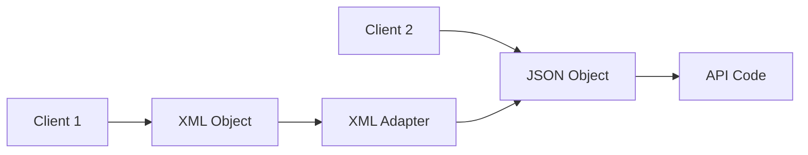
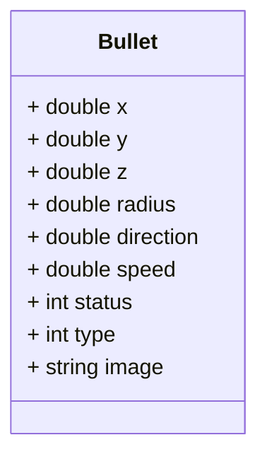
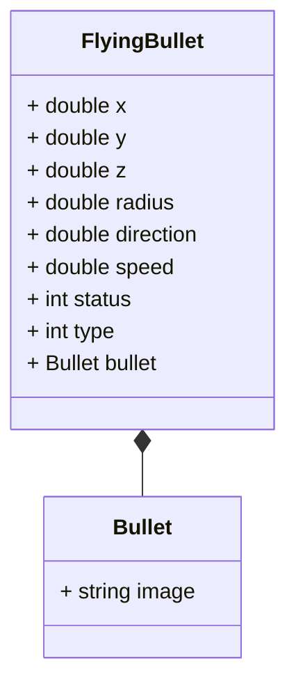

# Structural design patterns - Adapter and Flyweight

- [Structural design patterns - Adapter and Flyweight](#structural-design-patterns---adapter-and-flyweight)
  - [Key terms](#key-terms)
    - [Structural Patterns](#structural-patterns)
    - [Adapter](#adapter)
    - [Flyweight](#flyweight)
  - [Adapter](#adapter-1)
    - [Problem](#problem)
    - [Implementation](#implementation)
    - [Advantages](#advantages)
  - [Flyweight Pattern](#flyweight-pattern)
    - [Implementation](#implementation-1)
    - [Recap](#recap)
  - [Design patterns in different languages](#design-patterns-in-different-languages)
    - [Adapter](#adapter-2)
      - [Python](#python)
      - [JavaScript](#javascript)
    - [Flyweight](#flyweight-1)
      - [Python](#python-1)
      - [JavaScript](#javascript-1)
  
## Key terms
### Structural Patterns
> Structural patterns are design patterns that ease the design by identifying a simple way to realize relationships between entities.

> Structural patterns are concerned with how classes and objects are composed to form larger structures.

### Adapter
> The adapter pattern is a software design pattern (also known as wrapper, an alternative naming shared with the decorator pattern) that allows the interface of an existing class to be used from another interface. It is often used to make existing classes work with others without modifying their source code.

### Flyweight
> Flyweight is a structural design pattern that lets you fit more objects into the available amount of RAM by sharing common parts of state between multiple objects instead of keeping all of the data in each object.

## Adapter

> The adapter pattern is a structural pattern that allows objects with incompatible interfaces to collaborate.

We come across adapters in our day to day life. For example, we have a 3 pin plug and we want to use it in a 2 pin socket. We can use an adapter to convert the 3 pin plug to a 2 pin plug. 

So, we use an adapter to allow two incompatible interfaces to work together.
Similarly, in software development, we have two incompatible interfaces and we want to use them together. We can use an adapter to convert one interface to another. For instance, we have an API that returns a list of users. Now the request to this API requires a JSON object. Some clients instead of sending a JSON object, want to send an XML object. 

Should we change the API to accept an XML object? Should we create a new API that accepts an XML object? No, that would be redundant. This is where the adapter pattern comes into play. We can create an adapter that converts the XML object to a JSON object and then use the existing API.



You can create an adapter. This is a special object that converts the interface of one object so that another object can understand it.

An adapter wraps one of the objects to hide the complexity of conversion happening behind the scenes. The wrapped object isn’t even aware of the adapter. For example, you can wrap an object that operates in meters and kilometers with an adapter that converts all of the data to imperial units such as feet and miles.

Adapters can not only convert data into various formats but can also help objects with different interfaces collaborate. Here’s how it works:

* The adapter gets an interface, compatible with one of the existing objects.
* Using this interface, the existing object can safely call the adapter’s methods.
* Upon receiving a call, the adapter passes the request to the second object, but in a format and order that the second object expects.

### Problem

Let us take the example of payment processing.
As a part of our application we want to integrate with different payment gateways.
We first use the Stripe payment gateway. The stripe team provides us with a library that we can use to integrate with their payment gateway.

```java
public class StripeApi {
    public void createPayment() {
        // Create payment
    }

    public PaymentStatus checkStatus(String paymentId) {
        // Check payment status
    }
}
```

We use the Stripe API to create a payment and check the status of the payment.

```java
public void processPayment() {
    StripeApi stripeApi = new StripeApi();
    Payment object = stripeApi.createPayment();
    PaymentStatus status = stripeApi.checkStatus(object.getId());
}
```

Now we want to integrate with another payment gateway. We use the PayPal payment gateway. The PayPal team provides us with a library that we can use to integrate with their payment gateway.

```java
public class PayPalApi {
    public void makePayment() {
        // Create payment
    }

    public PaymentStatus getStatus(String paymentId) {
        // Check payment status
    }
}
```

As you can see, the Stripe API and the PayPal API have different method names. The Stripe API uses `createPayment` and `checkStatus` while the PayPal API uses `makePayment` and `getStatus`.
Should we change where we use the Stripe API to use the PayPal API? No, that would be redundant. That would require us to change the code in multiple places. Apart from the additional work, it would also increase the chances of introducing bugs. Also, when we want to switch back to the Stripe API, we would have to change the code again. Hence, our code is also violating SRP and OCP. We are also using concrete classes instead of interfaces. This makes our code tightly coupled.

### Implementation

1. `Incompatible classes` - You should have two classes that have incompatible interfaces. For example, the Stripe API and the PayPal API.
```java
public class StripeApi {
    public void createPayment() {
        // Create payment
    }

    public PaymentStatus checkStatus(String paymentId) {
        // Check payment status
    }
}

public class PayPalApi {
    public void makePayment() {
        // Create payment
    }

    public PaymentStatus getStatus(String paymentId) {
        // Check payment status
    }
}
```

2. `Adapter interface` - Create an interface for the adapter that will be used to convert the incompatible interfaces.
```java
public interface PaymentProvider {
    void makePayment();
    PaymentStatus getStatus(String paymentId);
}
```

3. `Concrete adapter classes` - Create a class that implements the target interface. This is the class that the client code expects to work with. The adapter will convert the interface of the existing class to this interface.
```java
public class StripeAdapter implements PaymentProvider {

    @Override
    public void makePayment() {
        ...
    }

    @Override
    public PaymentStatus getStatus(String paymentId) {
        ... 
    }
}

public class PayPalAdapter implements PaymentProvider {

    @Override
    public void makePayment() {
        ...
    }

    @Override
    public PaymentStatus getStatus(String paymentId) {
        ... 
    }
}
```

4. `Transform request and delegate to original class` - In the adapter class, transform the request to the format that the original class expects. Then, call the original class to perform the operation.
```java
public class StripePaymentProvider implements PaymentProvider {

    private StripeApi stripeApi = new StripeApi();

    @Override
    public void makePayment() {
        stripeApi.createPayment();
    }

    @Override
    public PaymentStatus getStatus(String paymentId) {
        StripeStatus status =  stripeApi.checkStatus(paymentId);
        return convertStatus(status);
    }
}
```

5. `Client code` - The client code expects to work with the target interface. The client code doesn’t know that the adapter is converting the interface of the original class.
```java
public class PaymentProcessor {
    private PaymentProvider paymentProvider;

    public PaymentProcessor(PaymentProvider paymentProvider) {
        this.paymentProvider = paymentProvider;
    }

    public void processPayment() {
        paymentProvider.makePayment();
        PaymentStatus status = paymentProvider.getStatus("paymentId");
    }
}
```

### Advantages
* You can use adapters to reuse existing classes with incompatible interfaces.
* You can even modify the request and response of the original classes.
* Single Responsibility Principle. You can separate the interface or data conversion code from the primary business logic of the program.
* Open/Closed Principle. You can introduce new types of adapters into the program without breaking the existing client code, as long as they work with the adapters through the target interface.

---
## Flyweight Pattern

> The flyweight pattern is used to reduce the memory footprint of a program by sharing as much data as possible with similar objects.

Today, we again assume the role of game developer and are looking to create a role-playing game like PUBG, counter strike etc. We modeled our game in various classes such as Map, User, Gun and Bullet. We are able to create a functional end to end game. The game works smoothly when you and your friend play it.
So you decide to host a game party to show off your new game. When a lot of players start playing the game, you notice that the game is lagging. You check the memory usage of the game and notice that the memory usage is very high. Each bullet was represented by a separate object containing plenty of data. At some point, when the carnage on a player’s screen reached its climax, newly created particles no longer fit into the remaining RAM, so the program crashed.

Let us take a closer look at the Bullet class.

The memory used by a single bullet instance would be:
* `Double`  - 8 bytes * 6 = 48 bytes
* `Integer` - 4 bytes * 2 = 8 bytes
* `Image` - 1KB

Let us say each person has around 400 bullets and there are 200 people playing the game. The total memory used by the bullets would be 1KB * 400 * 200 = 80MB. This is a lot of memory for just 200 people playing the game. Imagine if the number of bullets increase or the number of players increase. The memory usage would be even higher. For 2000 bullets for 200 players the memory usage would be 800MB.

The major problem here is for each object, the image field consumes a lot of memory. The image is also the same for all the bullets. 

Other parts of a particle’s state, such as coordinates, movement vector and speed, are unique to each particle. After all, the values of these fields change over time. This data represents the always changing context in which the particle exists, while the color and sprite remain constant for each particle.

This constant data of an object is usually called the intrinsic state. It lives within the object; other objects can only read it, not change it. The rest of the object’s state, often altered “from the outside” by other objects, is called the extrinsic state.

The Flyweight pattern suggests that you stop storing the extrinsic state inside the object. Instead, you should pass this state to specific methods which rely on it. Only the intrinsic state stays within the object, letting you reuse it in different contexts. As a result, you’d need fewer of these objects since they only differ in the intrinsic state, which has much fewer variations than the extrinsic.

So our Bullet class will have to be divided into two classes. One class will contain the intrinsic state and the other class will contain the extrinsic state. The extrinsic state will be passed to the methods that need it. 



Now, every bullet will have a reference to the Bullet object. The Bullet object will contain the image field. The FlyingBullet class will contain the extrinsic state. Each bullet does not need to have its own image field. The image field is shared between all the bullets. This way, the memory usage is reduced.

### Implementation
* `Intrinsic state` - The intrinsic state is stored in the flyweight object. It is independent of the flyweight’s context and remains the same for all flyweight objects.

```java
public class Bullet {
    private String image;
}
```
* `Extrinsic state` - The extrinsic state is stored or computed by client objects. It depends on the flyweight’s context and changes with it.

```java
public class FlyingBullet {
    private double x;
    private double y;
    private double z;
    private double radius;
    private double direction;
    private double speed;
    private int status;
    private int type;
    private Bullet bullet;
}
```

* `Flyweight factory` - The flyweight factory is responsible for creating and managing flyweight objects. It ensures that flyweights are shared properly. When a client requests a flyweight, the flyweight factory either returns an existing instance or creates a new one, if it doesn’t exist yet.

```java
public class BulletFactory {
    private static final Map<String, Bullet> bullets = new HashMap<>();

    public Bullet getBullet(BulletType type) {
        ...
    }

    public void addBullet(BulletType type, Bullet bullet) {
        ...
    }
}
```

* `Client code` - The client code usually creates a bunch of pre-populated flyweights in the initialization stage of the application.


### Recap
* The flyweight pattern is used to reduce the memory footprint of a program by sharing as much data as possible with similar objects.
* First we need to identify the intrinsic and extrinsic state of the object.
* The intrinsic state is stored in the flyweight object. It is independent of the flyweight’s context and remains the same for all flyweight objects.
* The extrinsic state is stored or computed by client objects. It depends on the flyweight’s context and changes with it.
* The extrinsic object contains a reference to the flyweight object or is composed of the flyweight object.
* A flyweight factory is responsible for creating and managing flyweight objects. It ensures that flyweights are shared properly. When a client requests a flyweight, the flyweight factory either returns an existing instance or creates a new one, if it doesn’t exist yet.
## Design patterns in different languages

### Adapter
#### Python
* [Adapter - I](https://refactoring.guru/design-patterns/adapter/python/example)
* [Adapter - II](https://sbcode.net/python/adapter/)
* [Adapter - III](https://github.com/faif/python-patterns/blob/master/patterns/structural/adapter.py)
* [Adapter - IV](https://gist.github.com/pazdera/1145859)

#### JavaScript
* [Adapter - I - Typescript](https://refactoring.guru/design-patterns/adapter/typescript/example#example-0)
* [Adapter - II](https://dev.to/wecarrasco/adapter-pattern-with-javascript-4lgi)
* [Adapter - III](https://jsmanifest.com/adapter-pattern-in-javascript/)
* [Adapter - IV](https://betterprogramming.pub/the-adapter-pattern-in-javascript-69c3f48ee164)

### Flyweight
#### Python
* [Flyweight - I](https://refactoring.guru/design-patterns/flyweight/python/example#:~:text=Flyweight%20is%20a%20structural%20design,object%20state%20between%20multiple%20objects.)
* [Flyweight - II](https://towardsdev.com/design-patterns-in-python-flyweight-pattern-ec3d321a86af)
* [Flyweight - III](https://sbcode.net/python/flyweight/)
* [Flyweight - IV](https://www.codespeedy.com/flyweight-design-pattern-in-python/)
* [Flyweight - V](https://github.com/gennad/Design-Patterns-in-Python/blob/master/flyweight.py)

#### JavaScript
* [Flyweight - I](https://refactoring.guru/design-patterns/flyweight/typescript/example)
* [Flyweight - II](https://www.oreilly.com/library/view/learning-javascript-design/9781449334840/ch09s18.html#:~:text=The%20Flyweight%20pattern%20is%20a,see%20Figure%209%2D12)
* [Flyweight - III](https://jsmanifest.com/power-of-flyweight-design-pattern-in-javascript/)
* [Flyweight - IV](https://www.patterns.dev/posts/flyweight-pattern/)
* [Flyweight - V](https://www.dofactory.com/javascript/design-patterns/flyweight)
