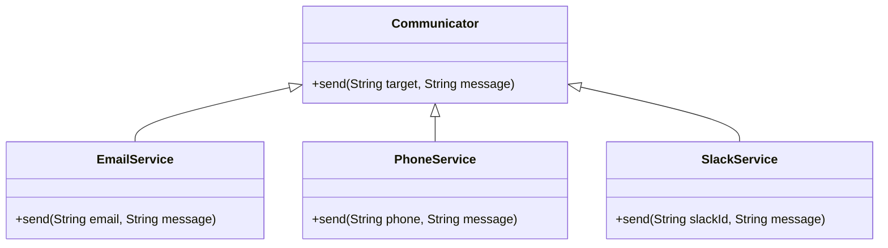
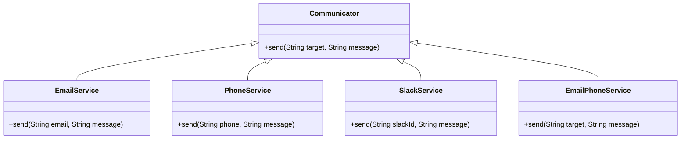

# Decorator and Facade
## Key terms
### Decorator
- A structural design pattern that allows adding new behaviors to objects by placing these objects inside special wrapper objects that contain the behaviors.

### Facade
- A structural design pattern that provides a simplified interface to a library, a framework, or any other complex set of classes.


## Decorator

The Decorator attaches additional responsibilities to an object dynamically. The ornaments that are added to pine or fir trees are examples of Decorators. Lights, garland, candy canes, glass ornaments, etc., can be added to a tree to give it a festive look. The ornaments do not change the tree itself which is recognizable as a Christmas tree regardless of particular ornaments used. As an example of additional functionality, the addition of lights allows one to "light up" a Christmas tree.

Another example: assault gun is a deadly weapon on it's own. But you can apply certain "decorations" to make it more accurate, silent and devastating.


### Problem
Let us say we want to build a class that sends our users emails with a greeting. We can start with a simple class:

```java
public class EmailService {
    public void sendEmail(String email, String message) {
        ...
    }
}
```

As the application grows we may want to add some additional functionality to our email service. For example, we may want to send phone notifications to our users or send them slack messages. We can obviously add new methods to our EmailService class, but this will violate the Single Responsibility Principle. So we do as we always do and abstract the functionality into a separate class:

```java
public interface Communicator {
    void send(String target, String message);
}
```

Now we have the following hierarchy:



The above hierarchy is fine, but what if we want to send emails to our users and also send them a phone notification? We can use the separate classes, but this will violate the Open-Closed Principle. We can't extend the functionality of our EmailService class, because it is final. So we need to create a new class that will encapsulate the functionality of the EmailService and the PhoneService classes:



The above approach is extremely brittle. If we want to add a new functionality, we will have to create a new class for each combination of existing functionalities. It also leads to class explosion. The number of classes grows exponentially with the number of possible combinations of functionalities.

### Solution

The problem with the above approach is that inheritance is static. We can't add new functionality to an existing class at runtime. Apart from that multiple inheritance is not supported in a lot of languages and hence to create a new class that encapsulates the functionality of multiple existing classes we have to duplicate the code of the existing classes.

Another option is to use composition. We can create a new class that will contain references to the existing classes and delegate the calls to the existing classes. This where the Decorator pattern comes in. The Decorator pattern allows us to add new functionality to an existing object without altering its structure. The Decorator pattern is also known as Wrapper.

A wrapper is an object that can be linked with some target object. The wrapper contains the same set of methods as the target and delegates to it all requests it receives. However, the wrapper may alter the result by doing something either before or after it passes the request to the target. The wrapper implements the same interface as the wrapped object.

The Decorator pattern is implemented with the following steps:
1. `Common product interface` - Declare the common interface for both wrappers and wrapped objects.
```java
public interface Communicator {
    void send(String target, String message);
}
```

2. `Concrete product` - Create a concrete product class that implements the common interface and represents the basic behavior of the wrapped object.
```java
public class EmailService implements Communicator {
    @Override
    public void send(String email, String message) {
        ...
    }
}
```

3. `Base decorator` - Create a base decorator class that implements the common interface and contains a field for storing a reference to a wrapped object.

```java
public abstract class CommunicatorDecorator implements Communicator {
    protected Communicator communicator;

    public CommunicatorDecorator(Communicator communicator) {
        this.communicator = communicator;
    }
}
```

4. `Concrete decorators` - Create concrete decorator classes that extend the base decorator class and add additional behavior to the wrapped object.

```java
public class PhoneService extends CommunicatorDecorator {
    public PhoneService(Communicator communicator) {
        super(communicator);
    }

    @Override
    public void send(String phone, String message) {
        communicator.send(phone, message);
        sendPhoneNotification(phone, message);
    }

    private void sendPhoneNotification(String phone, String message) {
        ...
    }
}
```

5. `Client` - The client code works with all objects using the common interface. This way it can stay independent of the concrete classes of objects it works with.

```java
public class Client {
    public static void main(String[] args) {
        Communicator communicator = new EmailService();
        Communicator phoneService = new PhoneService(communicator);
        Communicator slackService = new SlackService(phoneService);
        slackService.send("user", "Hello");
    }
}
```

### Advantages
* Object behavior can be extended at runtime by wrapping an object with one or several decorators without creating a new subclass.
* Runtime configuration of an object is possible.
* New behavior can be added to an object without changing its code.
* SRP is respected by encapsulating the behavior in a separate class.


## Facade

> Facade is a structural design pattern that provides a simplified interface to a library, a framework, or any other complex set of classes.

Facade means "face" in French. It is a front-facing building that is the main entrance to a building. The facade is the first thing that a visitor sees when they enter a building. The facade hides the complexity of the building from the visitor. The facade provides a simple interface to the building. The facade is a single point of entry to the building.

### Problem

Let us take the example of an e-commerce application. The application has a lot of functionality. It has a product catalog, a shopping cart, a payment system, a shipping system, etc. The application has a lot of classes and a lot of dependencies between them. The application is complex and it is hard to understand how all the classes work together. When you make an order, you have to do the following:
* Call payment gateway to charge the credit card.
* Update the inventory.
* Email the customer.
* Add the order to the shipping queue.
* Update analytics.
  
The above steps are not trivial. The application has a lot of classes and a lot of dependencies between them. The application is complex and it is hard to understand how all the classes work together. The application is also hard to maintain. If you want to change the way the application sends emails, you will have to change the code in multiple places. If you want to add a new feature, you will have to change the code in multiple places. Imagine how the class looks:
    
```java
public class Order {
    private PaymentGateway paymentGateway;
    private Inventory inventory;
    private EmailService emailService;
    private ShippingService shippingService;
    private AnalyticsService analyticsService;

    public void checkout() {
        paymentGateway.charge();
        inventory.update();
        emailService.send();
        shippingService.add();
        analyticsService.update();
    }
}
```

Here we have a lot of dependencies, some of which might be external vendors.
The business logic of your classes would become tightly coupled to the implementation details of 3rd-party classes, making it hard to comprehend and maintain. The Order class is hard to test. You will have to mock all the dependencies. The Order class is also hard to reuse. If you want to reuse the Order class in another application, you will have to change the code. Every time one of the logic changes, you will have to change the code in multiple places and hence violating SOLID principles.

A facade is a class that provides a simple interface to a complex subsystem which contains lots of moving parts. A facade might provide limited functionality in comparison to working with the subsystem directly. However, it includes only those features that clients really care about.

Having a facade is handy when you need to integrate your app with a sophisticated library that has dozens of features, but you just need a tiny bit of its functionality.

### Solution

The Facade pattern suggests that you wrap a complex subsystem with a simpler interface. The Facade pattern provides a higher-level interface that makes the subsystem easier to use. The Facade pattern is implemented by simply creating a new class that encapsulates the complex logic of the existing classes. For our example above, we will move the complex logic to a new class called OrderProcessor.

```java
public class OrderProcessor {
    private PaymentGateway paymentGateway;
    private Inventory inventory;
    private EmailService emailService;
    private ShippingService shippingService;
    private AnalyticsService analyticsService;

    public void process() {
        paymentGateway.charge();
        inventory.update();
        emailService.send();
        shippingService.add();
        analyticsService.update();
    }
}
```

Now we can use the OrderProcessor class in our Order class and delegate the complex logic to the OrderProcessor class.

```java
public class Order {
    private OrderProcessor orderProcessor;

    public void checkout() {
        orderProcessor.process();
    }
}
```
The Order class is now much simpler. It has a single responsibility of creating an order. The Order class is also easier to test. You can mock the OrderProcessor class. The Order class is also easier to reuse. You can reuse the Order class in another application without changing the code.