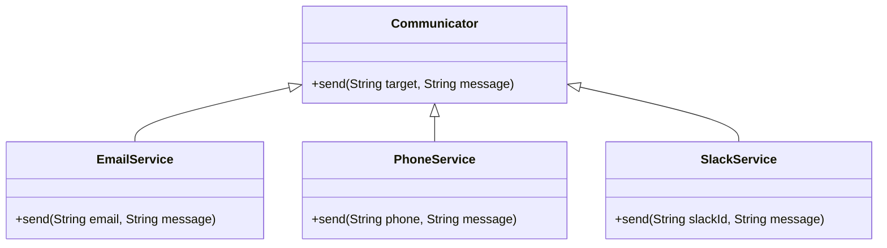
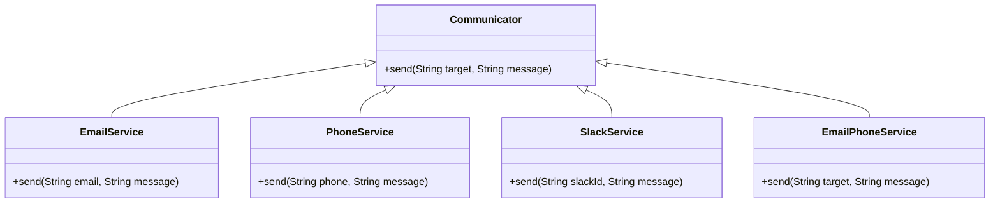
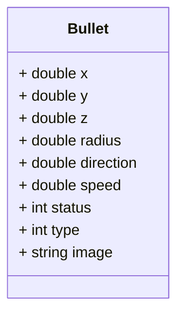
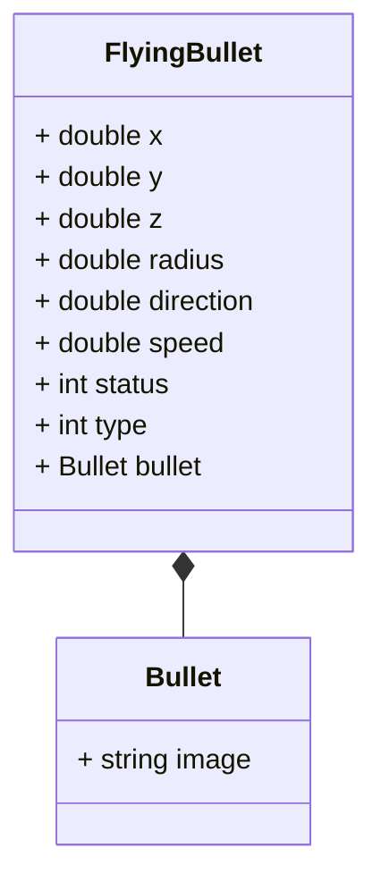

# Decorator and Flyweight
- [Structural design patterns - Decorator and Flyweight](#structural-design-patterns---decorator-and-flyweight)
  - [Key terms](#key-terms)
    - [Structural Patterns](#structural-patterns)
    - [Decorator](#decorator)
    - [Flyweight](#flyweight)
  - [Decorator](#decorator-1)
    - [Problem](#problem)
    - [Solution](#solution)
    - [Advantages](#advantages)
  - [Flyweight Pattern](#flyweight-pattern)
    - [Implementation](#implementation-1)
    - [Recap](#recap)
  - [Design patterns in different languages](#design-patterns-in-different-languages)
    - [Flyweight](#flyweight-1)
      - [Python](#python-1)
      - [JavaScript](#javascript-1)

## Key terms
### Decorator
- A structural design pattern that allows adding new behaviors to objects by placing these objects inside special wrapper objects that contain the behaviors.

### Flyweight
> Flyweight is a structural design pattern that lets you fit more objects into the available amount of RAM by sharing common parts of state between multiple objects instead of keeping all of the data in each object.


## Decorator

The Decorator attaches additional responsibilities to an object dynamically. The ornaments that are added to pine or fir trees are examples of Decorators. Lights, garland, candy canes, glass ornaments, etc., can be added to a tree to give it a festive look. The ornaments do not change the tree itself which is recognizable as a Christmas tree regardless of particular ornaments used. As an example of additional functionality, the addition of lights allows one to "light up" a Christmas tree.

Another example: assault gun is a deadly weapon on it's own. But you can apply certain "decorations" to make it more accurate, silent and devastating.


### Problem
Let us say we want to build a class that sends our users emails with a greeting. We can start with a simple class:

```java
public class EmailService {
    public void sendEmail(String email, String message) {
        ...
    }
}
```

As the application grows we may want to add some additional functionality to our email service. For example, we may want to send phone notifications to our users or send them slack messages. We can obviously add new methods to our EmailService class, but this will violate the Single Responsibility Principle. So we do as we always do and abstract the functionality into a separate class:

```java
public interface Communicator {
    void send(String target, String message);
}
```

Now we have the following hierarchy:



The above hierarchy is fine, but what if we want to send emails to our users and also send them a phone notification? We can use the separate classes, but this will violate the Open-Closed Principle. We can't extend the functionality of our EmailService class, because it is final. So we need to create a new class that will encapsulate the functionality of the EmailService and the PhoneService classes:



The above approach is extremely brittle. If we want to add a new functionality, we will have to create a new class for each combination of existing functionalities. It also leads to class explosion. The number of classes grows exponentially with the number of possible combinations of functionalities.

### Solution

The problem with the above approach is that inheritance is static. We can't add new functionality to an existing class at runtime. Apart from that multiple inheritance is not supported in a lot of languages and hence to create a new class that encapsulates the functionality of multiple existing classes we have to duplicate the code of the existing classes.

Another option is to use composition. We can create a new class that will contain references to the existing classes and delegate the calls to the existing classes. This where the Decorator pattern comes in. The Decorator pattern allows us to add new functionality to an existing object without altering its structure. The Decorator pattern is also known as Wrapper.

A wrapper is an object that can be linked with some target object. The wrapper contains the same set of methods as the target and delegates to it all requests it receives. However, the wrapper may alter the result by doing something either before or after it passes the request to the target. The wrapper implements the same interface as the wrapped object.

The Decorator pattern is implemented with the following steps:
1. `Common product interface` - Declare the common interface for both wrappers and wrapped objects.
```java
public interface Communicator {
    void send(String target, String message);
}
```

2. `Concrete product` - Create a concrete product class that implements the common interface and represents the basic behavior of the wrapped object.
```java
public class EmailService implements Communicator {
    @Override
    public void send(String email, String message) {
        ...
    }
}
```

3. `Base decorator` - Create a base decorator class that implements the common interface and contains a field for storing a reference to a wrapped object.

```java
public abstract class CommunicatorDecorator implements Communicator {
    protected Communicator communicator;

    public CommunicatorDecorator(Communicator communicator) {
        this.communicator = communicator;
    }
}
```

4. `Concrete decorators` - Create concrete decorator classes that extend the base decorator class and add additional behavior to the wrapped object.

```java
public class PhoneService extends CommunicatorDecorator {
    public PhoneService(Communicator communicator) {
        super(communicator);
    }

    @Override
    public void send(String phone, String message) {
        communicator.send(phone, message);
        sendPhoneNotification(phone, message);
    }

    private void sendPhoneNotification(String phone, String message) {
        ...
    }
}
```

5. `Client` - The client code works with all objects using the common interface. This way it can stay independent of the concrete classes of objects it works with.

```java
public class Client {
    public static void main(String[] args) {
        Communicator communicator = new EmailService();
        Communicator phoneService = new PhoneService(communicator);
        Communicator slackService = new SlackService(phoneService);
        slackService.send("user", "Hello");
    }
}
```

### Advantages
* Object behavior can be extended at runtime by wrapping an object with one or several decorators without creating a new subclass.
* Runtime configuration of an object is possible.
* New behavior can be added to an object without changing its code.
* SRP is respected by encapsulating the behavior in a separate class.


## Flyweight Pattern

> The flyweight pattern is used to reduce the memory footprint of a program by sharing as much data as possible with similar objects.

Today, we again assume the role of game developer and are looking to create a role-playing game like PUBG, counter strike etc. We modeled our game in various classes such as Map, User, Gun and Bullet. We are able to create a functional end to end game. The game works smoothly when you and your friend play it.
So you decide to host a game party to show off your new game. When a lot of players start playing the game, you notice that the game is lagging. You check the memory usage of the game and notice that the memory usage is very high. Each bullet was represented by a separate object containing plenty of data. At some point, when the carnage on a player’s screen reached its climax, newly created particles no longer fit into the remaining RAM, so the program crashed.

Let us take a closer look at the Bullet class.

The memory used by a single bullet instance would be:
* `Double`  - 8 bytes * 6 = 48 bytes
* `Integer` - 4 bytes * 2 = 8 bytes
* `Image` - 1KB

Let us say each person has around 400 bullets and there are 200 people playing the game. The total memory used by the bullets would be 1KB * 400 * 200 = 80MB. This is a lot of memory for just 200 people playing the game. Imagine if the number of bullets increase or the number of players increase. The memory usage would be even higher. For 2000 bullets for 200 players the memory usage would be 800MB.

The major problem here is for each object, the image field consumes a lot of memory. The image is also the same for all the bullets. 

Other parts of a particle’s state, such as coordinates, movement vector and speed, are unique to each particle. After all, the values of these fields change over time. This data represents the always changing context in which the particle exists, while the color and sprite remain constant for each particle.

This constant data of an object is usually called the intrinsic state. It lives within the object; other objects can only read it, not change it. The rest of the object’s state, often altered “from the outside” by other objects, is called the extrinsic state.

The Flyweight pattern suggests that you stop storing the extrinsic state inside the object. Instead, you should pass this state to specific methods which rely on it. Only the intrinsic state stays within the object, letting you reuse it in different contexts. As a result, you’d need fewer of these objects since they only differ in the intrinsic state, which has much fewer variations than the extrinsic.

So our Bullet class will have to be divided into two classes. One class will contain the intrinsic state and the other class will contain the extrinsic state. The extrinsic state will be passed to the methods that need it. 



Now, every bullet will have a reference to the Bullet object. The Bullet object will contain the image field. The FlyingBullet class will contain the extrinsic state. Each bullet does not need to have its own image field. The image field is shared between all the bullets. This way, the memory usage is reduced.

### Implementation
* `Intrinsic state` - The intrinsic state is stored in the flyweight object. It is independent of the flyweight’s context and remains the same for all flyweight objects.

```java
public class Bullet {
    private String image;
}
```
* `Extrinsic state` - The extrinsic state is stored or computed by client objects. It depends on the flyweight’s context and changes with it.

```java
public class FlyingBullet {
    private double x;
    private double y;
    private double z;
    private double radius;
    private double direction;
    private double speed;
    private int status;
    private int type;
    private Bullet bullet;
}
```

* `Flyweight factory` - The flyweight factory is responsible for creating and managing flyweight objects. It ensures that flyweights are shared properly. When a client requests a flyweight, the flyweight factory either returns an existing instance or creates a new one, if it doesn’t exist yet.

```java
public class BulletFactory {
    private static final Map<String, Bullet> bullets = new HashMap<>();

    public Bullet getBullet(BulletType type) {
        ...
    }

    public void addBullet(BulletType type, Bullet bullet) {
        ...
    }
}
```

* `Client code` - The client code usually creates a bunch of pre-populated flyweights in the initialization stage of the application.


### Recap
* The flyweight pattern is used to reduce the memory footprint of a program by sharing as much data as possible with similar objects.
* First we need to identify the intrinsic and extrinsic state of the object.
* The intrinsic state is stored in the flyweight object. It is independent of the flyweight’s context and remains the same for all flyweight objects.
* The extrinsic state is stored or computed by client objects. It depends on the flyweight’s context and changes with it.
* The extrinsic object contains a reference to the flyweight object or is composed of the flyweight object.
* A flyweight factory is responsible for creating and managing flyweight objects. It ensures that flyweights are shared properly. When a client requests a flyweight, the flyweight factory either returns an existing instance or creates a new one, if it doesn’t exist yet.


### Flyweight
#### Python
* [Flyweight - I](https://refactoring.guru/design-patterns/flyweight/python/example#:~:text=Flyweight%20is%20a%20structural%20design,object%20state%20between%20multiple%20objects.)
* [Flyweight - II](https://towardsdev.com/design-patterns-in-python-flyweight-pattern-ec3d321a86af)
* [Flyweight - III](https://sbcode.net/python/flyweight/)
* [Flyweight - IV](https://www.codespeedy.com/flyweight-design-pattern-in-python/)
* [Flyweight - V](https://github.com/gennad/Design-Patterns-in-Python/blob/master/flyweight.py)

#### JavaScript
* [Flyweight - I](https://refactoring.guru/design-patterns/flyweight/typescript/example)
* [Flyweight - II](https://www.oreilly.com/library/view/learning-javascript-design/9781449334840/ch09s18.html#:~:text=The%20Flyweight%20pattern%20is%20a,see%20Figure%209%2D12)
* [Flyweight - III](https://jsmanifest.com/power-of-flyweight-design-pattern-in-javascript/)
* [Flyweight - IV](https://www.patterns.dev/posts/flyweight-pattern/)
* [Flyweight - V](https://www.dofactory.com/javascript/design-patterns/flyweight)
