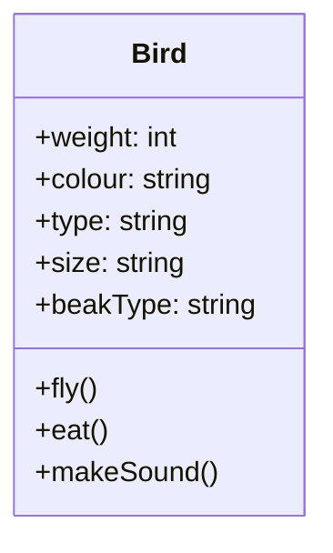
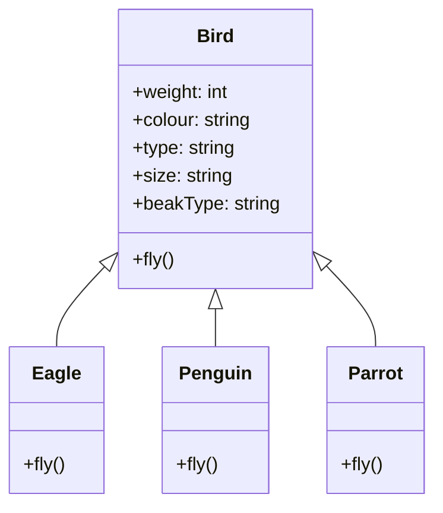

# SOLID principles 1: SRP and OCP
- [SOLID principles](#solid-principles)
  - [Key terms](#key-terms)
    - [SOLID principles](#solid-principles-1)
    - [Single responsibility principle](#single-responsibility-principle)
    - [Open/closed principle](#openclosed-principle)
  - [Single responsibility principle](#single-responsibility-principle-1)
    - [Case study - Design a bird](#case-study---design-a-bird)
    - [Reasons to follow SRP](#reasons-to-follow-srp)
    - [How/Where to spot violations of SRP?](#howwhere-to-spot-violations-of-srp)
    - [Side-assignment alert](#side-assignment-alert)
  - [Open/closed principle](#openclosed-principle-1)
    - [Abstract classes and interfaces](#abstract-classes-and-interfaces)
      - [Interface](#interface)
    - [When to use abstract classes and interfaces?](#when-to-use-abstract-classes-and-interfaces)
    - [Fixing OCP violation in the `Bird` class](#fixing-ocp-violation-in-the-bird-class)
  - [Reading List](#reading-list)

## Key terms
### SOLID principles
> SOLID is a mnemonic acronym for five design principles intended to make object-oriented designs more understandable, flexible, and maintainable. 

### Single responsibility principle
> There should never be more than one reason for a class/code unit to change. Every class should have only one responsibility.

### Open/closed principle
> Software entities (classes, modules, functions, etc.) should be open for extension, but closed for modification.

## Single responsibility principle

> When designing our classes, we should aim to put related features together, so whenever they tend to change they change for the same reason. And we should try to separate features if they will change for different reasons.

<p align="center">
    
</p>

The Single Responsibility Principle states that a class should do one thing, and therefore it should have only a single reason to change. Only one potential change (database logic, logging logic, and so on.) in the software’s specification should be able to affect the specification of the class.

This means that if a class is a data container, like a Book class or a Student class, and it has some fields regarding that entity, it should change only when we change the data model.

### Case study - Design a bird

To understand the SOLID principles, let us take the help of a bird. A bird is a living creature that can fly, eat, and make a sound. How can we design a bird?

The simplest solution would be to create a `Bird` class with different attributes and methods. A bird could have the following attributes:
* Weight
* Colour
* Type
* Size
* BeakType

A bird would also exhibit the following behaviours:
* Fly
* Eat
* Make a sound



The `Bird` class would look as follows:
    
```java
public class Bird {
    private int weight;
    private String colour;
    private String type;
    private String size;
    private String beakType;

    public void fly() {
        ...
    }

    public void eat() {
        ...
    }

    public void makeSound() {
        ...
    }
}
```

In order to understand the design further, let us try to implement the `fly` method.
Since each bird has a different method of flying, we would have to implement conditional statements to check the type of the bird and then call the appropriate method.

```java
public void fly() {
    if (type.equals("eagle")) {
        flyLikeEagle();
    } else if (type.equals("penguin")) {
        flyLikePenguin();
    } else if (type.equals("parrot")) {
        flyLikeParrot();
    }
}
```

The above code exhibits the following problems:
* `Readability` - The code is not readable. It is difficult to understand what the code is doing.
* `Testing` - It is difficult to test the code. We would have to test each type of bird separately.
* `Reusability` - The code is not reusable. If we want to re-use the code of specific type of bird, we would have to change the above code.
* `Parallel development` - The code is not parallel development friendly. If multiple developers are working on the same code, they could face merge conflicts.
* `Multiple reasons to change` - The code has multiple reasons to change. If we want to change the way a type of bird flies, we would have to change the code in the `fly` method.


### Reasons to follow SRP
Apart from overcoming the problems mentioned above, there are other reasons to follow the SRP:
* Maintainability - Smaller, well-organized classes are easier to search than monolithic ones.
* Ease of testing – A class with one responsibility will have far fewer test cases.
* Lower coupling – Less functionality in a single class will have fewer dependencies.

### How/Where to spot violations of SRP?
* A method with multiple `if-else` statements. An example would be the `fly` method of the `Bird` class. This is not a silver bullet, but it is a good indicator. There can be other reasons for multiple `if-else` statements such as business logic e.g. calculating the tax, checking access rights, etc.
* `Monster methods` or `God classes` - Methods that are too long and doing much more than the name suggests. This is a good indicator of a violation of SRP.

```java
public saveToDatabase() {
    // Connect to database
    // Create a query
    // Execute the query
    // Create a user defined object
    // Close the connection
}
```
The above method is doing much more than the name suggests. It is connecting to the database, creating a query, executing the query, creating a user defined object, and closing the connection. This method violates the SRP. It should be split into multiple methods such as `connectToDatabase`, `createQuery`, `executeQuery`, `createUserDefinedObject`, and `closeConnection`.
* `Utility classes` - Utility classes are classes that contain only static methods which are used to perform some utility functions. Have a look at the utility package of Java [here](https://docs.oracle.com/javase/8/docs/api/java/util/package-summary.html). There is just way too many responsibilities of this package.

### Side-assignment alert
* Identify the violations of SRP in [this](../code/src/../oop/src/main/java/com/scaler/lld/questions/Invoice.java) class.
* Refactor the code to follow SRP.

--- 

## Open/closed principle
We identified a bunch of problems with the `Bird` class. Let us see the fly method again to spot another problem.

```java
public void fly() {
    if (type.equals("eagle")) {
        flyLikeEagle();
    } else if (type.equals("penguin")) {
        flyLikePenguin();
    } else if (type.equals("parrot")) {
        flyLikeParrot();
    }
}
```

In the above code, we are checking the type of the bird and then calling the appropriate method. If we want to add a new type of bird, we would have to change the code in the `fly` method. This is a violation of the Open/Closed Principle.

<p align="center">
    
</p>

**The Open/Closed Principle states that a class should be open for extension but closed for modification. This means that we should be able to add new functionality to the class without changing the existing code.** To add a new feature, we should ideally create a new class or method and have very little or no changes in the existing code.
In doing so, we stop ourselves from modifying existing code and causing potential new bugs in an otherwise happy application. We should be able to add new functionality without touching the existing code for the class. This is because whenever we modify the existing code, we are taking the risk of creating potential bugs. So we should avoid touching the tested and reliable (mostly) production code if possible.

* A module will be said to be open if it is still available for extension. For example, it should be possible to add fields to the data structures it contains, or new elements to the set of functions it performs.
* A module will be said to be closed if [it] is available for use by other modules. This assumes that the module has been given a well-defined, stable description (the interface in the sense of information hiding).

### Abstract classes and interfaces

An abstract class is nothing but a class that is declared using the abstract keyword. It also allows us to declare method signatures using the abstract keyword (abstract method) and forces its subclasses to implement all the declared methods. Suppose if a class has a method that is abstract, then the class itself must be abstract.

Abstract classes have no restrictions on field and method modifiers, while in an interface, all are public by default. We can have instance and static initialization blocks in an abstract class, whereas we can never have them in the interface. Abstract classes may also have constructors which will get executed during the child object's instantiation.

Abstract classes can be defined using the `abstract` keyword. An abstract class can have abstract methods and non-abstract methods. An abstract method is a method that is declared without an implementation. It is a method that is declared using the `abstract` keyword and does not have a body. An abstract class can have a constructor and it gets executed when an object of the child class is created. An abstract class can have instance variables, static variables, instance methods, static methods, and abstract methods.

```java
public abstract class Animal {
    private String name;
    private int age;

    public Animal(String name, int age) {
        this.name = name;
        this.age = age;
    }

    public abstract void makeSound();

    public void eat() {
        System.out.println("Eating...");
    }
}
```

#### Interface

An Interface in Java programming language is defined as an abstract type used to specify the behavior of a class. An interface in Java is a blueprint of a class. A Java interface contains static constants and abstract methods. The interface in Java is a mechanism to achieve abstraction.

You can think of an interface as a completely abstract class that can only contain abstract methods. An interface is similar to a class, in that it contains methods and variables, but the methods declared in an interface are by default abstract (only method signature, no body). Interfaces cannot be used to create objects (in the example above, it is not possible to create an "Animal" object). An interface is not inherited by a class; it must be implemented by a class.

```java
public interface Animal {
    public void makeSound();
}
```

### When to use abstract classes and interfaces?
* If multiple classes have common functionalities, we would like to use inheritance to avoid code duplication and also have fixed contracts so that the subclasses are forced to implement the common functionalities.
* If the common classes have common attributes, consider using abstract classes since they can have instance variables.
* If the common classes have common methods, consider using interfaces since they can have only abstract methods. However, the implementation of the methods can be different in the subclasses. Interfaces are also useful when we want to have multiple inheritance.

### Fixing OCP violation in the `Bird` class

Now that we have learnt about abstract classes and interfaces, let us fix the SRP and OCP violation in the `Bird` class. In order to fix the SRP violations, we would consider having a parent class `Bird` and child classes `Eagle`, `Penguin`, and `Parrot`. Since, different birds have the same attributes and behaviours, we would want to use classes. An instance of the `Bird` class does not make sense, hence we would use an abstract class. We can't use an interface since we would want to have instance variables. We would also want to have a fixed contract for the subclasses to implement the common functionalities. Hence, we would use an abstract class.
Now, our `Bird` class would look like this.



## Reading List
* [SOLID vs CUPID vs GRASP](https://www.boldare.com/blog/solid-cupid-grasp-principles-object-oriented-design/#what-is-solid-and-why-is-it-more-than-just-an-acronym?-solid-vs.-cupid---is-the-new-always-better?)
* [Java and SRP](https://medium.com/swlh/java-packages-and-the-single-responsibility-principle-a23e151719d1)