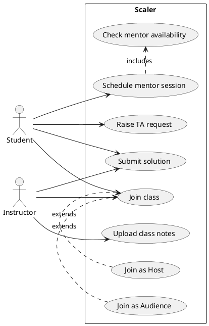
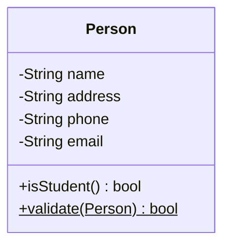
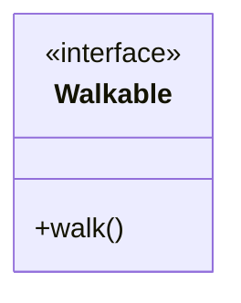
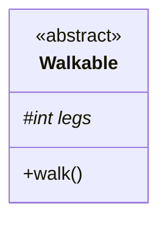
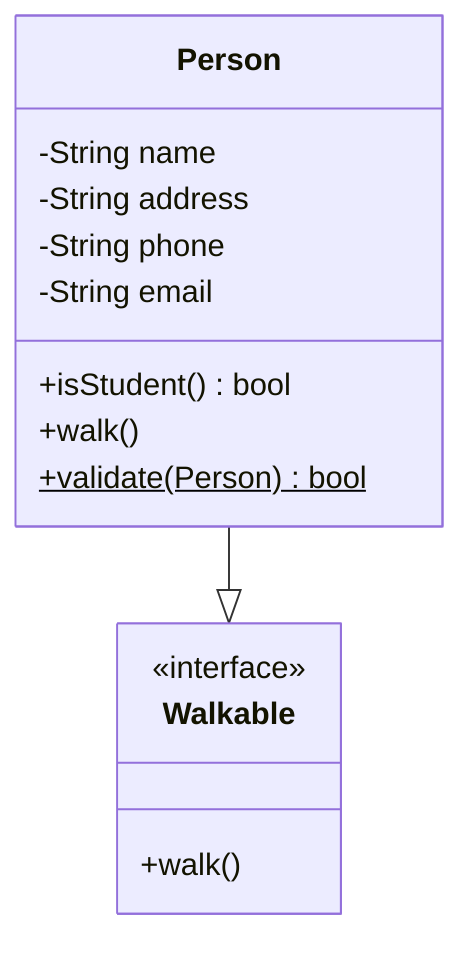
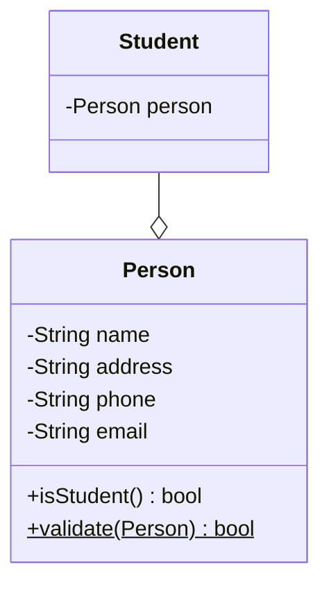
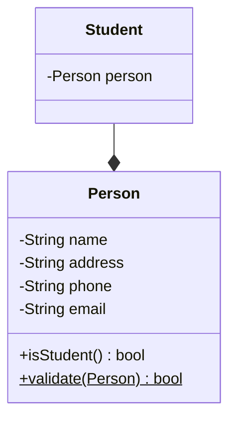
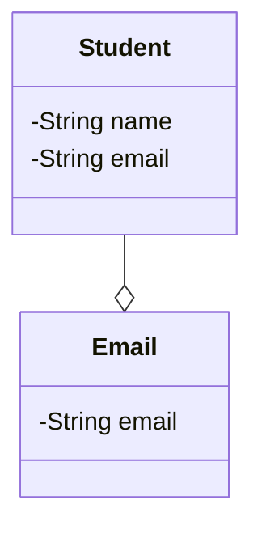
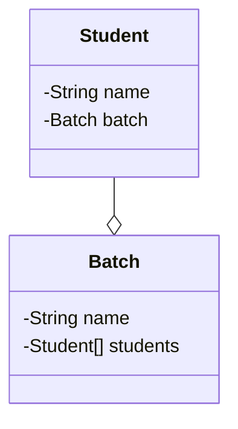
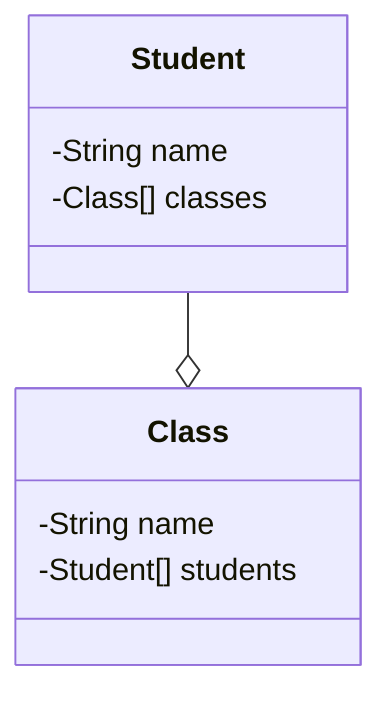

# UML - Use case and class diagrams
- [UML - Use case and class diagrams](#uml---use-case-and-class-diagrams)
  - [UML diagrams](#uml-diagrams)
    - [Structural diagrams](#structural-diagrams)
    - [Behavioral diagrams](#behavioral-diagrams)
      - [Use case diagram](#use-case-diagram)
  - [Assignment](#assignment)
    - [Solution](#solution)
  - [Class diagram](#class-diagram)
    - [Entities and attributes](#entities-and-attributes)
      - [Attributes](#attributes)
      - [Methods](#methods)
      - [Interfaces and abstract classes](#interfaces-and-abstract-classes)
    - [Relationships](#relationships)
      - [Cardinality](#cardinality)

## UML diagrams

> UML is a general-purpose, developmental, modeling language in the field of software engineering that is intended to provide a standard way to visualize the design of a system.

Maintainability is a key factor in software development.
A codebase is worked on by many people over a long period of time. For a new developer to be able to understand the codebase, it is important to have a good documentation. UML diagrams are a good way to document the design of a system.
Apart from documentation, UML diagrams are also used to communicate the design of a system to other developers.
It is very important to document our design decisions so that we can refer to them later and even get feedback from other developers.

UML diagrams are a great way to visualize the design of a system. They are a great way to communicate with other developers and stakeholders. They are also a great way to document the design of a system. There are two main types of UML diagrams - 
* `Structural diagrams` - These diagrams are used to describe the structure of a system. They are used to describe the classes and objects in a system. They are also used to describe the relationships between classes and objects.
* `Behavioral diagrams` - These diagrams are used to describe the behavior of a system. They are used to describe the interactions between classes and objects. They are also used to describe the sequence of events in a system.

### Structural diagrams

> Structural diagrams are used to describe the structure of a system. They are used to describe the classes and objects in a system. They are also used to describe the relationships between classes and objects.

There are four main types of structural diagrams -
* `Class diagram` - This diagram is used to describe the classes and objects in a system. It is also used to describe the relationships between classes and objects.
* `Object diagram` - This diagram is used to describe the objects in a system. It is also used to describe the relationships between objects.
* `Component diagram` - This diagram is used to describe the components in a system. It is also used to describe the relationships between components.
* `Package diagram` - This diagram is used to describe the packages in a system. It is also used to describe the relationships between packages.

### Behavioral diagrams

> Behavioral diagrams are used to describe the behavior of a system. They are used to describe the interactions between classes and objects. They are also used to describe the sequence of events in a system.

There are four main types of behavioral diagrams -
* `Use case diagram` - This diagram is used to describe the use cases in a system and the actors that interact with the system.
* `Sequence diagram` - This diagram is used to describe the sequence of events in a system.
* `Activity diagram` - This diagram is used to describe the flow of control in a system.
* `State diagram` - This diagram is used to describe the state of an object in a system.

Learn more about different types of UML diagrams [here](https://creately.com/blog/diagrams/uml-diagram-types-examples/).

#### Use case diagram

> A use case diagram is a behavioral diagram that is used to describe the use cases in a system and the actors that interact with the system.

Use case diagrams give a graphic overview of the actors involved in a system, different functions needed by those actors and how these different functions interact. It’s a great starting point for any project discussion because you can easily identify the main actors involved and the main processes of the system.

Some main components of a use case diagram are -
* `System boundary` - This is the boundary of the system. It is the boundary of the system that we are designing. It contains all the use cases that are part of the system. All the internal elements of the system are part of the system boundary, but the external elements are not part of the system boundary.
* `Use case` - This represents a functionality or a feature that is supported by a system. A use case is represented by an ellipse/oval. The name of the use case is written inside the ellipse/oval.
* `Actor` - This represents a person or a system that interacts with the system. An actor is represented by a stick figure.
* `Relationships` - Not all use cases will be available for all actors. For instance, a user can login but cannot change their email. An admin can login and change emails. We draw a line between actors and their supported use cases to represent the relationships between them.
* `Include` - This is a relationship between two use cases. It represents that one use case is a subset of another use case. For instance, a use case to create an order has a dependency on the payment use case. We draw an arrow from the create order use case to the payment use case to represent this relationship.
* `Extend` - This is a relationship between two use cases. It represents that one use case can be extended by another use case. For instance, there can be multiple ways to login such as login with email, login with phone number, login with social media. We draw an arrow from the different login use cases to the login use case to represent this relationship.

## Assignment

* Draw a use case diagram for Scaler Academy.
* Your use case diagram should have at least 5 use cases.
* Your use case diagram should have at least 2 actors.
* Introduce a use case that should depend on another use case. (Use include relationship)
* Introduce a use case that should extend another use case. (Use extend relationship)

### Solution

Actors

<ul>
<li>Student</li>
<li>Instructor</li>
</ul>

Use cases 

<ul>
<li> Join class </li>
<li>Schedule mentor session </li>
<li>Raise TA request </li>
<li> Upload class notes </li>
<li> Submit solution </li>
<li> Check mentor availability</li>
<li> Check plagiarism </li>
<li> Join as Host </li>
<li> Join as Audience </li>
</ul>

Include relationship

<ul>
<li>Schedule mentor session depends on Check mentor availability</li>
<li>Submit solution depends on Check plagiarism</li>
</ul>

Extend relationship

<ul>
<li>Join as Host extends Join class</li>
<li>Join as Audience extends Join class</li>
</ul>

Use case diagram

Learn more about PlantUML [here](https://plantuml.com/).

## Class diagram

A class diagram is a graphical representation of a system's low level implementation and describes the realtionships between the various components of the system. A class diagram represents the following components of a system:
* Classes
* Interfaces
* Abstract classes

The following data points about the relationships between the components are also represented:
* Which classes implement which interfaces?
* Which class is a subclass?
* Which class is a superclass?
* Which class is an attribute of another class?

### Entities and attributes

A class is represented by a rectangle with the name of the class in the middle. The attributes and methods of the class are presented in the rectangle. The attributes are presented in the top half of the rectangle and the methods are presented in the bottom half of the rectangle.

#### Attributes

Attributes are the properties of a class. An attribute is represented in the form of 
> [access modifier] [attribute name]: [attribute type]
The following are parts of an attribute:
* `Access modifier` - Visibility of the attribute. It can be one of the following:
  * `+` public
  * `-` private
  * `#` protected
  * `~` package
* `Attribute name` - Name of the attribute
* `Attribute type` - Type of the attribute. It can be a primitive type or a class type.

#### Methods

Methods are the operations that can be performed on a class. A method is represented in the form of
> [access modifier] [method name]([parameter list]): [return type]

The following are parts of a method:
* `Access modifier` - Visibility of the method. Same as the access modifier of an attribute.
* `Method name` - Name of the method
* `Parameter list` - List of parameters that the method takes but instead of the parameter name, the parameter type is used. The parameters are separated by commas.
* `Return type` - Type of the value returned by the method. It can be a primitive type or a class type.

Static methods and attributes are underlined.

#### Interfaces and abstract classes

An interface is a contract that a class must implement. An interface is represented by a rectangle with the name of the interface in the middle surrounded by an angled bracket. The methods of the interface are presented in the rectangle.

Similarly, abstract classes and methods are italicized.

### Relationships

There are 2 major types of relationships between classes:
* `Inheritance` - A relationship between a superclass and a subclass. The subclass inherits the attributes and methods of the superclass.
* `Association` - A relationship between 2 classes. The classes are associated with each other. The association can be one of the following:
  * `Aggregation` - A relationship between 2 classes where the lifetime of the child class is dependent on the lifetime of the parent class. The child class can exist without the parent class.
  * `Composition` - A relationship between 2 classes where the lifetime of the child class is dependent on the lifetime of the parent class. The child class cannot exist without the parent class.

Inheritance is represented by a line with an arrow pointing to the superclass. Sometimes the arrow is replaced by a triangle.

Aggregation is represented by a line with a diamond at the end of the line.

Composition is represented by a line with a filled diamond at the end of the line.

#### Cardinality

> Cardinality is the maximum times an entity can relate to an instance with another entity or entity set.

> the number of interactions entities have with each other.

**One to One (1:1)**
>  A "one-to-one" relationship is seen when one instance of entity 1 is related to only one instance of entity 2 and vice-versa

A student can only have one email address and one email address can be associated with only one student.

An attribute shared by both entities can be added to either of the entities.

**One to Many or Many to one (1:m or m:1)**
> When one instance of entity 1 is related to more than one instance of entity 2, the relationship is referred to as "one-to-many.

A student can only be associated with one batch, but a batch can have many students.

An attribute shared by both entities can only be added to the entity which has multiple instances i.e. the M side.

**Many to Many (m:n)**

> When multiple instances of entity 1 are linked to multiple instances of entity 2, we have a "many-to-many" relationship. Imagine a scenario where an employee is assigned more than one project.

A student can attend multiple classes and a class can have multiple students.

