# Design BookMyShow

## Context

BookMyShow is India's biggest online movie and events ticketing brand. The website caters to ticket sales for movies, plays, concerts and sporting events via the online platform.

BookMyShow is an online ticketing facility like Movietickets.com, Explara and Ticketmaster.com. BookMyShow took the primary services provided by these two websites and consolidated it into one website for movies, plays, events and sports tickets. Apart from being an online ticketing portal, BookMyShow offers information about upcoming movies and events, show timings, venue details and artist bios.

## Requirements gathering

What are some questions you would ask to gather requirements?

1. Can a cinema hall have multiple screens/halls?
2. Can a movie be shown in multiple halls?
3. Can a movie be of multiple languages?
4. Can a user book multiple tickets for a single movie?
5. Are there multiple types of tickets?
6. How does user find a movie?
7. How does a user book a ticket?
8. How does a user pay for a ticket?
9. How does a new movie get added to the system?
10. Are there any discounts available?

## Requirements

Build an online movie ticket booking system that can support the following requirements:

* Support for multiple cities
* Each city will have multiple cinemas
* Each cinema can have multiple halls
* Each hall will play one movie at a time
* A cinema will play multiple movies
* Each hall can have multiple types of seats
  * GOLD
  * DIAMOND
  * PLATINUM
* Allow the user to search a movie by name
* Allow the user to filter movies by the following fields
  * Location
  * Cinema
  * Language
  * Rating
  * Category
* Each movie can have multiple slots
* Users can book tickets and pay via multiple payment methods
  * UPI
  * Credit Card
  * Netbanking
* A user can apply a coupon or a promo code at checkout
* A user can see the availability of seats in a hall
* The price of a ticket will be decided by multiple parameters
  * Seat Type
  * Day of the week
  * Time of the Day
  * Movie
  * Cinema hall
* A user can also cancel or update a booking
* A user cannot book or cancel after the cutoff time which is 1 hour before the movie starts

## Use case diagrams

Are the requirements clear enough to define use cases?
If not, try to think of the actors and their interactions with the system.

### Actors

What would be the actors in this system?

1. User
2. Admin

### Use cases

What would be the use cases i.e. the interactions between the actors and the system?

#### Actor 1

Name of actor - `Admin`

Use cases:
* Add a new movie
* Add a new cinema hall
* Add a new show

#### Actor 2

Name of actor - `User`

Use cases:
* Search for a movie
* Book a ticket
* Pay for a ticket
* Cancel a ticket

---

Draw the use case diagram.

## Class diagrams

What will be the major classes and their attributes?

* City
  * name
  * Theaters
* Theater
  * name
  * address
  * Halls
  * Shows
* Hall
  * name
  * Seats
  * Shows
* Seat
  * Number
  * Type - `GOLD, DIAMOND, PLATINUM`
* Show
  * Movie
  * start time
  * duration
  * Language
  * ShowSeats
* Movie
  * name
  * rating
  * category
  * languages
  * Shows
* Ticket
  * amount
  * Seats
  * Show
  * User
  * Payment
  * Status
* Payment
  * amount
  * Mode - `UPI, CREDIT_CARD, NETBANKING`
  * Status - `SUCCESS, FAILED`
  * Ticket

Draw the class diagram.

```mermaid
classDiagram
  class City {
    -String name
    -Theater[] theaters
  }

  class Theater {
    -String name
    -String address
    -Hall[] halls
    -Show[] shows
  }

  class Hall {
    -String name
    -Seat[] seats
    -Show[] shows
  }

  class Seat {
    -String number
    -String type
  }

  class Show {
    -Movie movie
    -Date startTime
    -int duration
    -String language
    -ShowSeat[] showSeats
  }

  class Movie {
    -String name
    -int rating
    -String category
    -String[] languages
    -Show[] shows
  }

  class ShowSeat {
    -Seat seat
    -Show show
    -SeatStatus status
  }

  class SeatStatus {
    <<enumeration>>
    AVAILABLE
    BOOKED
  }

  class Ticket {
    -double amount
    -Seat[] seats
    -Show show
    -User user
    -Payment payment
    -TicketStatus status
  }

  class Payment {
    -double amount
    -PaymentMode mode
    -PaymentStatus status
    -Ticket ticket
  }

  class PaymentMode {
    <<enumeration>>
    UPI
    CREDIT_CARD
    NETBANKING
  }

  class PaymentStatus {
    <<enumeration>>
    SUCCESS
    FAILED
  }

  class TicketStatus {
    <<enumeration>>
    BOOKED
    CANCELLED
  }
```

## API design

What will be some APIs that you would design for this system?

Look at the use cases and try to design APIs for each of them.

You can simply write the APIs in the following format:
`API name` - `HTTP method` - `URL` - `?Request body` - `?Response body`

You could also use a tool like [Swagger](https://swagger.io/) to design the APIs or follow [this](https://github.com/jamescooke/restapidocs) repository for a simple way to use Markdown to structure your API documentation.
