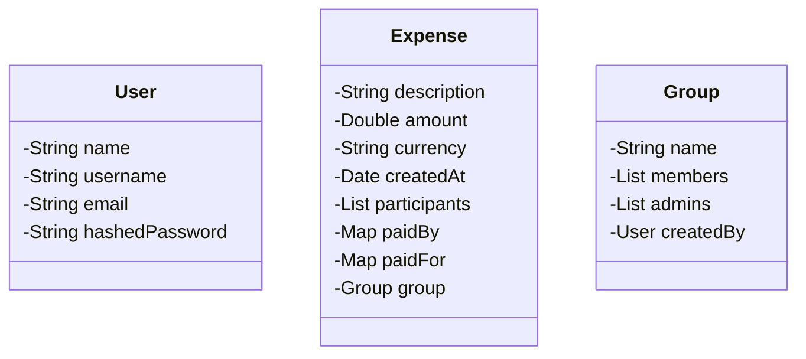
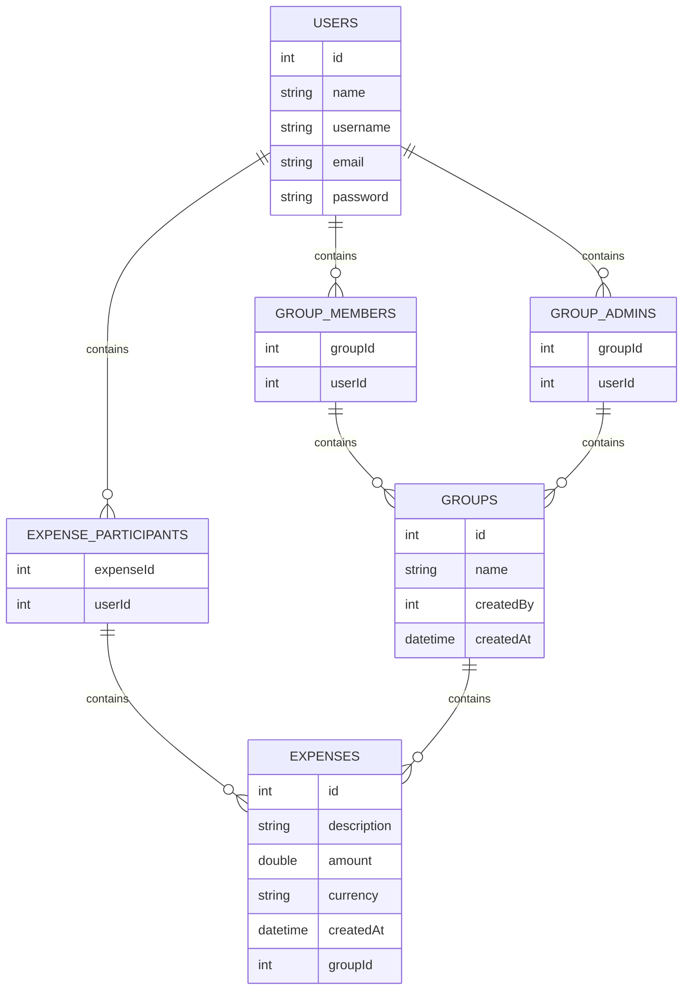

# Design Splitwise

## Context

> Splitwise makes it easy to split bills with friends and family. We organize all your shared expenses and IOUs in one place, so that everyone can see who they owe. Whether you are sharing a ski vacation, splitting rent with roommates, or paying someone back for lunch, Splitwise makes life easier. We store your data in the cloud so that you can access it anywhere: on iPhone, Android, or on your computer.

## Requirements

- Users can register and update their profiles.
- A user's profile should contain at least their name, phone number and password
- Users can participate in expenses with other users
- Users can participate in groups.
- To add an expense, a user must specify either the group, or the other users involved in the expense, along with who paid
  what and who owes what. They must also specify a description for the expense.
- A user can see their total owed amount
- A user can see a history of the expenses they're involved in
- A user can see a history of the expenses made in a group that they're participating in
- Users shouldn't be able to query about groups they are not a member of
- Only the user who has created a group can add/remove members to the group
- Users can request a settle-up. The application should show a list of transactions, which when executed will ensure that
  the user no longer owes or recieves money from any other user. Note that this need not settle-up any other users.
- Users can request a settle-up for any group they're participating in. The application should show a list of transactions,
  which if executed, will ensure that everyone participating in the group is settled up (owes a net of 0 Rs). Note that will
  only deal with the expenses made inside that group. Expenses outside the group need not be settled.
  Good to Have Requirements
- When settling a group, we should try to minimize the number of transactions that the group members should make to
  settle up.

Note: All tests will be performed in one go. The application doesn't need to persist data between runs.

### Input Format

`Register vinsmokesanji 003 namisswwaann`

> u1 is registering with the username "vinsmokesanji", phone "003" and password as "namisswwaann"
-- --
`u1 UpdateProfile robinchwan`

> u1 is updating their profile password to "robinchwan"
-- --
`u1 AddGroup Roommates`

> u1 is creating a group titled "Roommates"
-- --
`u1 AddMember g1 u2`

> u1 is adding u2 as a member of the group "Roommates" (which has the id g1)
-- --
`u1 MyTotal`
> u1 is asking to see the total amount they owe/recieve after everything is settled.
-- --
`u1 History`
> u1 is asking to see their history of transactions (whether added by themselves or someone
else)
-- --
`u1 Groups`
> u1 is asking to see the groups that they're a member of
-- --
`u1 SettleUp`
> u1 is asking to see the list of transactions they should perform to settle up
-- --
`u1 SettleUp g1`
> u1 is asking to see the list of transactions that need to be performed by members of g1 to
completely settle up the group.
-- --
`u1 Expense g1 iPay 1000 Equal Desc Wifi Bill`
> u1 is adding an expense in the group g1.
> u1 paid 1000 Rs
> each user of g1 owes an equal amount (the exact amount will depend on the number of users in group g1. Say g1 has 5
users, then the amount owed by each will be 200Rs).
-- --
`u1 Expense u2 u3 u4 iPay 1000 Equal Desc Last night dinner`
> u1 is adding an expense with users u2, u3 and u4.
> u1 paid 1000 Rs
> each user owes an equal amount - 250Rs.
-- --
`u1 Expense u2 u3 iPay 1000 Percent 20 30 50 Desc House rent`
> u1 is adding an expense with users u2 and u3
> u1 paid 1000 Rs
> u1 owes 20% (200Rs), u2 owes 30% (300Rs) and u3 owes 50% (500Rs).
-- --
`u1 Expense u2 u3 u4 iPay 1000 Ratio 1 2 3 4 Desc Goa trip`
> u1 is adding an expense with users u2, u3 and u4.
> u1 paid 1000 Rs
> u1 owes 100Rs (1 part), u2 owes 200Rs (2 parts), u3 owes 300Rs (3 parts) and u4 owes 400Rs (4
parts).
-- --
`u1 Expense u2 u3 iPay 1000 Exact 100 300 600 Desc Groceries`
> u1 is adding an expense with users u2 and u3.
> u1 paid 1000 Rs
> u1 owes 100Rs, u2 owes 300Rs and u3 owes 600Rs.
-- --
`u1 Expense u2 u3 MultiPay 100 300 200 Equal Desc Lunch at office`
> u1 is adding an expense with users u2 and u3.
> u1 paid 100 Rs, u2 paid 300Rs and u3 paid 200Rs.
> Each user owes an equal amount - 200Rs.
-- --
`u1 Expense u2 u3 MultiPay 500 300 200 Percent 20 30 50 Desc Netflix subscription`
> u1 is adding an expense with users u2 and u3.
> u1 paid 500 Rs, u2 paid 300Rs and u3 paid 200Rs.
> u1 owes 20% (200Rs), u2 owes 30% (300Rs) and u3 owes 50% (500Rs).

## Class diagrams

What will be the major classes and their attributes?

* User
  * name
  * username
  * email
  * password
* Expense
  * description
  * amount
  * currency
  * createdAt
  * Participants
  * paidBy
  * paidFor
  * Group
* Group
  * name
  * Members
  * Admins
  * CreatedBy

Draw the class diagram.

!!! Note
    The class diagram can be optimised further. Think about it.

## Schema design

What will be the tables and their columns?

* User - `USERS`
  * id
  * name
  * username
  * email
  * password
* Expense - `EXPENSES`
  * id - PK
  * description - VARCHAR(255)
  * amount - DOUBLE
  * currency - VARCHAR(3)
  * createdAt - DATETIME
  * groupId - FK
* Group - `GROUPS`
  * id - PK
  * name - VARCHAR(255)
  * createdBy - FK
  * createdAt - DATETIME
* `Mapping` - `GROUP_MEMBERS`
  * groupId - FK
  * userId - FK
* `Mapping` - `GROUP_ADMINS`
  * groupId - FK
  * userId - FK
* `Mapping` - `EXPENSE_PARTICIPANTS`
  * expenseId - FK
  * userId - FK

