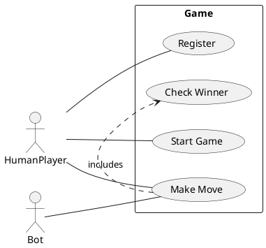
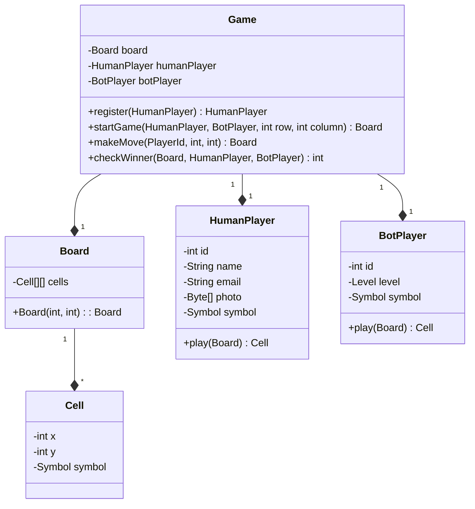
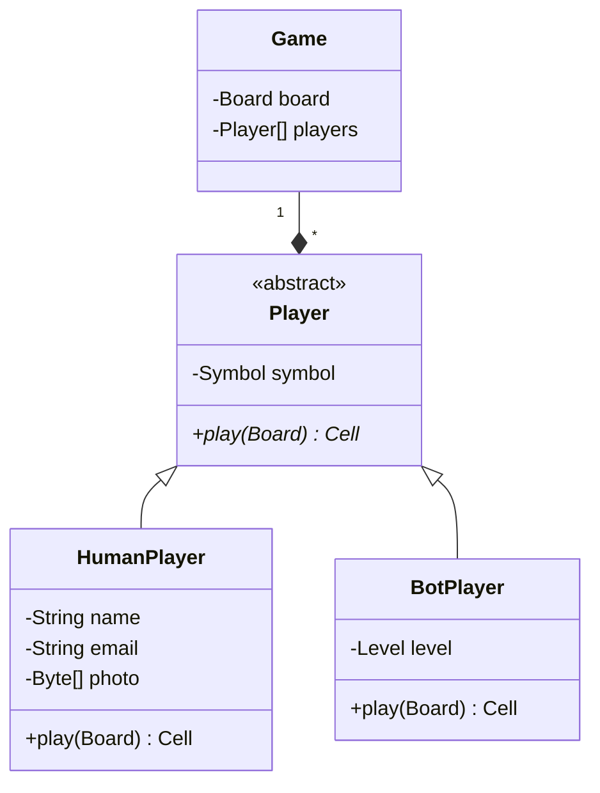
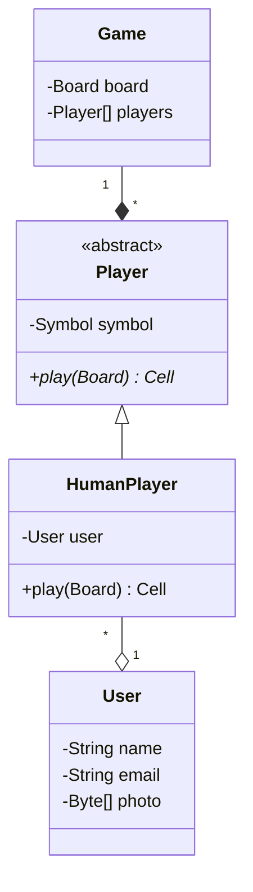
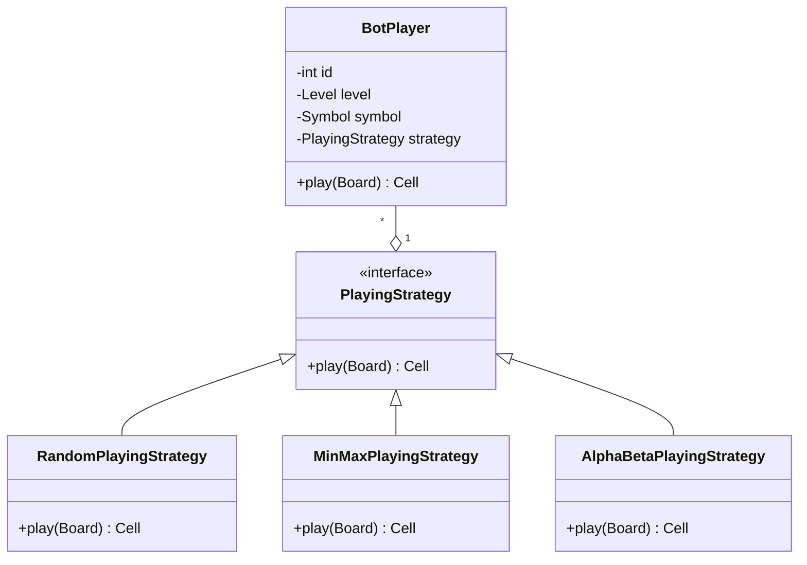

# Design Tic-Tac-Toe

## What is Tic-Tac-Toe?

TicTacToe is a 2 player game played on a 3 x 3 board. Each player is allotted a symbol (one X and one O). Initially, the board is empty. Alternatively, each player takes a turn and puts their symbol at any empty slot. The first player to get their symbol over a complete row OR a complete column OR a diagonal wins.

You can play the game within Google Search by just searching for “tictactoe”!


## Questions to Ask
* Will the game be played amongst only 2 players or can there be any number of players in future?
* Is the board size restricted to 3x3 or can it be any NxN?
* Can there be different ways to win?
* Can one of the players be a bot?
* Feature Suggestions:
  * Do we want to time a move? Skip/ Declare the other person as winner if the move doesn’t happen within x seconds.
  * Do we want to support undo operation?
  * Can there be some players who are just watching? Not playing.
  * Do we want to store analytics? Basically previous games, who played what move etc.
  * Support for tournaments? Basically a set of matches, each match between 2 players of the tournament.

## Expectations
* The code should be working and functionally correct
* Good software design practices should be followed:
* Code should be modular, readable, extensible
* Separation of concern should be addressed
* Project structured well across multiple files/ packages
* Write unit tests
* No need of GUI


## Problem Requirements
* Board can be of any NxN size.
* There can be two players.
* Each player will be allotted a symbol.
* The symbol can be one of O and X.
* The players can be either humans or bots.
* Each human player will have a name, email and profile image.
* Each bot player will have a difficulty level.
* Any random player can start the game.
* Then the players will take turns alternatively.
* The player with any consecutive N symbols in a row, column or diagonal wins.
* If the board is full and no player has won, the game is a draw.

## Entities and their attributes
* Game
  * Board
  * Players
* Board
  * Cells
* Cell
  * Row
  * Column
  * Symbol
* Human Player
  * Name
  * Email
  * Profile Image
* Bot Player
  * Difficulty Level

## Design 

### Use Case Diagram


### Initial Design



* There is no common contract for players. Parent class to represent all different types of players.
* There is tight coupling between Game and different types of players. It is not extensible to support multiple players
* OCP and SRP violation in play method.
* Huge memory consumption - multiple instances of the player will be created for multiple games. Each instance has a new photo.

## Common contract - Player abstract class

- Common behaviour - `play`
- Common attributes - `Symbol`



* ~~There is no common contract for players. Parent class to represent all different types of players.~~
* ~~There is tight coupling between Game and different types of players. It is not extensible to support multiple players~~
* OCP and SRP violation in play method.
* Huge memory consumption - multiple instances of the player will be created for multiple games. Each instance has a new photo.

## Tight coupling
-HumanPlayer
-BotPlayer 
-Player[] players
``mermaid
``


## OCP and SRP violation in play method - Strategy

## Huge memory consumption - Flyweight

- Paul Morphy
- Instance 1 -
  - name - Paul Morphy
  - email - paul@blind.in
  - photo - 5MB
  - symbol - O
- Instance 2 -
  - name - Paul Morphy
  - email - paul@blind.in
  - photo - 5MB
  - symbol - X
  
- Store fields that do not change in a class - Intrinsic state
- Store field that change in a class - Extrinsic state




* Problems so far
* OCP and SRP violation in play method.


### Implement different levels in a bot

```java

class BotPlayer {

  private Level level;

  private Cell play(Board board) {
    switch (level) {
      case EASY:
        // Really easy move
      case MEDIUM:
        // Medium level moves
    }
  }
}
```



* Inject different behaviours
* Such that they can be reused
  * Strategy Design pattern


* There is no common contract for players. Parent class to represent all different types of players. - Abstract classes
* There is tight coupling between Game and different types of players. It is not extensible to support multiple players - `List<Player>`
* OCP and SRP violation in play method.
  - Strategy pattern
* Huge memory consumption - multiple instances of the player will be created for multiple games. Each instance has a new photo. - Flyweight